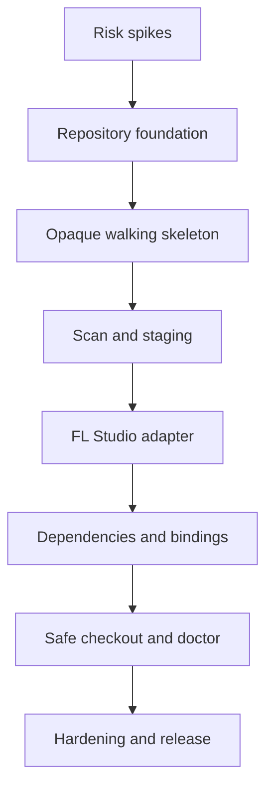

# DAWVC — MVP Implementation Plan

> **Documentversie:** 1.0  
> **Status:** Approved implementation baseline  
> **Doelrelease:** MVP v0.1 public technical preview  
> **Normatieve requirements:** `DAWVC_MVP_Requirements.md` v1.0  
> **Normatieve architectuur:** `DAWVC_Technical_Design.md` v1.1  
> **Teammodel:** één ontwikkelaar  
> **Schattingseenheid:** ideale werkdagen, zonder kalenderdeadline

---

# 1. Doel

Dit plan vertaalt de MVP-requirements naar een uitvoerbare ontwikkelvolgorde. Het plan stuurt op vroeg werkende verticale slices, aantoonbare integriteit en gecontroleerde risicoreductie.

Het eerste bruikbare resultaat is niet de volledige dependency-adapter, maar een walking skeleton die een `.flp` opaque kan committen, tonen in history en byte-exact kan herstellen. Daarna worden inspectie, dependencies, bindings en diagnose toegevoegd.

---

# 2. Vaststaande uitgangspunten

- C# en .NET 10;
- Windows 11 x64 als officieel MVP-platform;
- CLI-only;
- public technical preview en portfolio-waardige publieke GitHub-repository;
- MIT-licentie;
- één repository per logisch muziekproject;
- één primaire `.flp` per snapshot;
- FL Studio 2026.x als eerste geteste DAW-versie;
- core vanaf dag één DAW-onafhankelijk;
- BLAKE3 contentidentity;
- immutable objecten en atomic ref updates;
- read-only FL Studio-adapter;
- geen FLP-writing, pluginloading of automatische FL Studio-configuratiewijziging;
- hybride staging;
- geen remote, server, desktop, merge of locking in v0.1;
- self-contained Windows x64 ZIP-release;
- maximaal 5.000 gevolgde assets en 100 GB bundled content als referentieschaal;
- technische schattingen in ideale werkdagen, niet in kalenderdata.

---

# 3. Deliverystrategie

## 3.1 Verticale slices

Iedere mijlpaal moet eindigen met aantoonbaar uitvoerbaar gedrag. Domeinlagen worden alleen gebouwd wanneer een use-case ze direct gebruikt.



## 3.2 Integrity-first

Voor objectwriting, commitrefupdates en checkout geldt:

1. happy-pathtest;
2. failure-pathtest;
3. fault-injectiontest;
4. pas daarna integratie in de CLI.

## 3.3 Geen impliciete scope-uitbreiding

Een issue dat remote, desktop, semantic merge, native writing of een tweede DAW vereist wordt naar de post-MVP-backlog verplaatst. Alleen een wijziging die nodig is om een bestaande Must-requirement te halen mag de v0.1-scope vergroten.

---

# 4. Werkafspraken

## 4.1 Definition of Ready voor een implementatietaak

Een taak is ready wanneer:

- de gekoppelde requirement-ID’s bekend zijn;
- input, output en foutgedrag zijn beschreven;
- relevante domain invariants zijn benoemd;
- testfixtures beschikbaar of als subtaken gepland zijn;
- geen onbeantwoorde productkeuze resteert;
- afhankelijkheden zijn afgerond of expliciet gemockt kunnen worden.

## 4.2 Definition of Done voor een implementatietaak

Een taak is done wanneer:

- productiecode gereviewd of via een self-reviewchecklist gecontroleerd is;
- unit- en relevante integrationtests slagen;
- bekende failure modes getest zijn;
- typed errors en logging zijn toegevoegd;
- publieke of persisted contracten gedocumenteerd zijn;
- requirementtraceability is bijgewerkt;
- formatters, analyzers en build zonder warnings slagen;
- geen tijdelijke debugcode, secrets of commerciële fixturecontent aanwezig is.

## 4.3 Branch- en commitstrategie voor de DAWVC-codebase

- `main` blijft releasable;
- korte featurebranches per issue;
- Conventional Commits of een vergelijkbaar consistent formaat;
- pull request/self-reviewtemplate met requirement-ID’s en testbewijs;
- ADR bij wijzigingen aan persisted formats, hashing, atomiciteit of adaptergrenzen.

---

# 5. Solution- en projectstructuur

De eerste solution bevat alleen projecten die voor v0.1 nodig zijn.

```text
src/
  DawVcs.Domain/
  DawVcs.Application/
  DawVcs.Infrastructure/
  DawVcs.Adapters.Abstractions/
  DawVcs.Adapters.FLStudio/
  DawVcs.Cli/

tests/
  DawVcs.Domain.Tests/
  DawVcs.Application.Tests/
  DawVcs.Infrastructure.Tests/
  DawVcs.Adapters.FLStudio.Tests/
  DawVcs.IntegrationTests/
  DawVcs.EndToEndTests/

fixtures/
  flstudio/
  repositories/

docs/
  technical-design.md
  mvp-requirements.md
  implementation-plan.md
  adr/
```

Referentierichting:

```text
CLI ───────────────► Application ───────────────► Domain
Infrastructure ───► Application ports + Domain
FL Studio Adapter ► Adapter Abstractions + Domain contracts
Application ──────► Adapter Abstractions
```

Verboden referenties:

- Domain → Infrastructure;
- Domain → CLI;
- Domain → FL Studio;
- FL Studio Adapter → CLI;
- Application → concrete Infrastructureimplementaties.

---

# 6. Mijlpalenoverzicht

| Mijlpaal | Resultaat | Werkpakketten | Indicatie |
|---|---|---|---:|
| M0 — Feasibility | Grootste risico’s bewezen of begrensd | WP-00–WP-01 | 6–9 dagen |
| M1 — Opaque VCS | `.flp` init/commit/log/restore byte-exact | WP-02–WP-03 | 13–19 dagen |
| M2 — Working tree | Scan, hybride staging en status | WP-04 | 6–9 dagen |
| M3 — DAW awareness | Read-only FLP-detectie en validatie | WP-05 | 8–12 dagen |
| M4 — Portability | Dependencies, bundling en bindings | WP-06 | 8–12 dagen |
| M5 — Safe workflow | Checkout, branches, doctor en fsck | WP-07–WP-08 | 14–20 dagen |
| M6 — Technical preview | Performance, security, packaging en docs | WP-09–WP-10 | 12–18 dagen |

**Totale orde van grootte:** 67–99 ideale werkdagen.

Deze schatting bevat engineering, geautomatiseerde tests en technische documentatie. Zij bevat geen kalenderbuffer, marketing, langdurige gebruikerssupport of onvoorziene reverse-engineering van onbekende FLP-structuren.

---

# 7. WP-00 — Repository bootstrap en engineering baseline

**Doel:** een reproduceerbare, strikt gecontroleerde ontwikkelomgeving neerzetten.

**Requirements:** NFR-MNT-001 t/m NFR-MNT-005, NFR-REL-003, NFR-REL-006.

**Indicatie:** 2–3 dagen.

## Taken

- **IMP-0001:** Git-repository initialiseren met `main`, `.gitignore`, `.editorconfig` en MIT-licentie.
- **IMP-0002:** .NET 10 solution en projecten uit hoofdstuk 5 aanmaken.
- **IMP-0003:** nullable reference types, deterministic builds en warnings-as-errors activeren.
- **IMP-0004:** analyzers en formatter configureren.
- **IMP-0005:** xUnit-testprojecten en gedeelde testutilities opzetten.
- **IMP-0006:** GitHub Actions voor restore, build, test en formatting op Windows instellen.
- **IMP-0007:** Aanvullende Ubuntu-job voor zuivere Domain/Application-tests toevoegen om onbedoelde Windowscoupling te detecteren.
- **IMP-0008:** README-skelet, contributing-notes en pull-requesttemplate toevoegen.
- **IMP-0009:** `docs/adr/ADR-000-template.md` en initiële ADR-index maken.
- **IMP-0010:** Requirementtraceabilitybestand of testtraitconventie vastleggen.

## Exitcriteria

- clean clone bouwt zonder lokale handelingen;
- alle lege/smoketests slagen op Windows;
- Domain en Application bouwen op Ubuntu;
- dependencyregels worden minimaal via architecture tests bewaakt;
- publieke repository bevat geen secrets of gelicentieerde DAW-content.

---

# 8. WP-01 — Risico- en feasibilityspikes

**Doel:** vóór productcode de onzekerheden rond FLP-inspectie, BLAKE3, objecten en atomiciteit begrenzen.

**Requirements:** FR-FLP-001 t/m FR-FLP-012, FR-OBJ-001 t/m FR-OBJ-010, NFR-INT-003 t/m NFR-INT-005.

**Indicatie:** 4–6 dagen.

## Spike A — FLP-detectie en read-only inspectie

- verzamel zelfgemaakte minimale FL Studio 2026.x-fixtures;
- identificeer stabiele signature-, header- en versievelden;
- test empty project, één sample, recording, één native plugin en één VST3-plugin;
- documenteer welke samplepaden en pluginidentiteiten betrouwbaar uitleesbaar zijn;
- test truncated, wrong-extension en unknown-version fixtures;
- bewijs met voor/na-hashes dat inspectie de bronbytes niet wijzigt;
- leg parsergrenzen en fallbackgedrag vast in `ADR-ADP-001`.

## Spike B — BLAKE3-libraryselectie

Selectiecriteria:

- actieve maintenance;
- streaming API;
- correcte officiële testvectors;
- voorspelbare licentie;
- ondersteuning voor .NET 10 en win-x64;
- geen volledige-file buffering;
- meetbare performance op grote WAV-fixtures.

De keuze wordt vastgelegd in `ADR-HASH-001`.

## Spike C — Object-envelope

- definieer magic bytes, veldvolgorde, endianness en maximale lengtes;
- implementeer een disposable prototypewriter/-reader;
- test truncation, verkeerde magic, onbekende versie, length mismatch en hash mismatch;
- leg het exacte byteformat vast in `ADR-OBJ-001`.

## Spike D — Windows atomic replace

- test atomic file install binnen hetzelfde NTFS-volume;
- test process kill vóór write, na flush en vóór replace;
- definieer recoverygedrag als atomic replace niet beschikbaar is;
- leg gekozen primitives vast in `ADR-IO-001`.

## Exitcriteria

- er is een go/no-gorapport voor automatische FLP-dependencyextractie;
- unsupported/unknown fallback is bewezen;
- geselecteerde BLAKE3-implementatie slaagt voor testvectors;
- object-envelope is bevroren voor schema v1;
- safe-writeprimitive heeft fault-injectionbewijs;
- geen spikecode wordt automatisch productiecode zonder review en tests.

---

# 9. WP-02 — Domain foundation en object store

**Doel:** immutable identities, artifactmodel en veilige lokale objectopslag implementeren.

**Requirements:** INV-001 t/m INV-011, FR-OBJ-001 t/m FR-OBJ-010, NFR-MNT-001.

**Indicatie:** 6–9 dagen.

## Taken

- **IMP-0201:** Strongly typed IDs en value objects voor repository, commit, snapshot, blob, asset, dependency en adapter implementeren.
- **IMP-0202:** `ContentHash` en streaming `IContentHasher` implementeren.
- **IMP-0203:** `ProjectArtifact`, `SingleFileArtifact`, `DirectoryArtifact`, `PackageArtifact` en `ArchiveArtifact` modelleren.
- **IMP-0204:** `ArtifactPath` canonicalizer met NFC, `/`, traversal- en collisionvalidatie implementeren.
- **IMP-0205:** Deterministische aggregate hashing voor artifacttrees implementeren.
- **IMP-0206:** Object-envelope reader/writer volgens ADR-OBJ-001 implementeren.
- **IMP-0207:** Loose object store met tijdelijke write, flush, hashverification en atomic publish implementeren.
- **IMP-0208:** Deduplicatie en collisiondefense implementeren.
- **IMP-0209:** JSON canonicalization en `schemaVersion`-infrastructuur implementeren.
- **IMP-0210:** Object-store fault-injectionhooks voor tests toevoegen.

## Testset

- officiële BLAKE3-vectors;
- lege en zeer grote streamingpayload;
- duplicate blob;
- zelfde naam, andere bytes;
- truncated envelope;
- onbekende envelopeversie;
- hash mismatch;
- crash vóór atomic publish;
- path normalization en case-collision;
- deterministic aggregate hash over gewijzigde enumeration order.

## Exitcriteria

- geen objectwriter publiceert incomplete content;
- identieke bytes dedupliceren;
- objectreads detecteren alle gemodelleerde corruptiegevallen;
- Domain heeft geen concrete filesystemdependency;
- artifactmodel representeert alle vier containervormen zonder DAW-specifieke types.

---

# 10. WP-03 — Opaque walking skeleton

**Doel:** de eerste end-to-end versiecontrole voor een `.flp` opleveren zonder dependencysemantiek.

**Requirements:** FR-REP-001 t/m FR-REP-010, FR-CFG-001 t/m FR-CFG-004, FR-COM-001 t/m FR-COM-011, FR-CHK-001 t/m FR-CHK-007, AC-001.

**Indicatie:** 7–10 dagen.

## Verticale use-case

```text
dawvc init
dawvc commit -m "Initial version"
dawvc log
dawvc checkout <commit> --restore-to <empty-folder>
```

## Taken

- **IMP-0301:** Repositoryroot discovery en `dawvc init` use-case implementeren.
- **IMP-0302:** `dawvc.yaml` schema v1 reader, validator en writer implementeren.
- **IMP-0303:** Exact-one-primary-artifactselectie implementeren.
- **IMP-0304:** Commit-, snapshot- en refobjecten implementeren.
- **IMP-0305:** `HEAD`, `refs/heads/main` en atomic ref-update implementeren.
- **IMP-0306:** Opaque primary artifact snapshotten.
- **IMP-0307:** `commit`-orchestratie implementeren zonder adapterafhankelijkheid.
- **IMP-0308:** `log` query en CLI-output implementeren.
- **IMP-0309:** Read-only snapshotresolution en staged restore naar `--restore-to` implementeren.
- **IMP-0310:** CLI-shell met `System.CommandLine`, `Spectre.Console`, `--help`, `--version`, `--no-color` en cancellation bouwen.
- **IMP-0311:** Typed errorbasis en exitcodemapping implementeren.
- **IMP-0312:** End-to-end AC-001 automatiseren.

## Exitcriteria

- een zelfgemaakte `.flp` kan worden gecommit en gelogd;
- restore naar een lege directory is byte-identiek;
- dezelfde flow werkt ook wanneer geen adapter beschikbaar is;
- crash vóór refupdate laat `main` op de vorige geldige commit;
- een no-opcommit wordt geweigerd;
- CLI toont geen ongecontroleerde stacktrace voor bekende fouten.

---

# 11. WP-04 — Working tree, scan, hybride staging en status

**Doel:** wijzigingen en nieuwe assets voorspelbaar beheren.

**Requirements:** FR-SCAN-008 t/m FR-SCAN-012, FR-STG-001 t/m FR-STG-010, NFR-PERF-004, NFR-PERF-007.

**Indicatie:** 6–9 dagen.

## Taken

- **IMP-0401:** SQLite lokale index en Dapper repositories implementeren.
- **IMP-0402:** Filesystem metadata cache voor file identity, size en timestamps implementeren.
- **IMP-0403:** Working-tree vergelijking met HEAD implementeren.
- **IMP-0404:** Primary artifact automatisch als tracked content behandelen.
- **IMP-0405:** `scan`-pipeline en scanresultaatmodel implementeren.
- **IMP-0406:** Lokale staging index implementeren.
- **IMP-0407:** `add <path>`, `add --all` en portabilitychecks implementeren.
- **IMP-0408:** `status`-groepen staged, modified, added, removed, unresolved en policy-blocked implementeren.
- **IMP-0409:** Content-based rename detection implementeren.
- **IMP-0410:** Cancellation en crash recovery voor scan/indexupdates testen.
- **IMP-0411:** Warm-status benchmarkfixture toevoegen.

## Exitcriteria

- nieuwe content wordt nooit stil aan een commit toegevoegd;
- tracked `.flp` en tracked assets volgen actuele bytes;
- statusresultaten zijn deterministisch;
- indexcorruptie kan worden herbouwd uit repository en filesystem;
- unchanged warm status haalt bij voorkeur de performancebaseline.

---

# 12. WP-05 — FL Studio read-only adapter

**Doel:** FLP-formatdetectie, healthvalidatie en best-effort metadataextractie leveren.

**Requirements:** FR-SCAN-001 t/m FR-SCAN-007, FR-FLP-001 t/m FR-FLP-012, NFR-SEC-001, NFR-SEC-002, NFR-SEC-004.

**Indicatie:** 8–12 dagen.

## Taken

- **IMP-0501:** Adapter abstractions en capabilityflags implementeren.
- **IMP-0502:** `ArtifactReadContext` zonder writehandle implementeren.
- **IMP-0503:** FL Studio 2026.x formatpolicy implementeren.
- **IMP-0504:** Extension/signature/structure detection met evidence en confidence implementeren.
- **IMP-0505:** Bounded binary reader met offsets, lengthchecks en cancellation implementeren.
- **IMP-0506:** FLP-versie- en basisprojectmetadataextractie implementeren.
- **IMP-0507:** Structurele validation statuses `Valid`, `Suspicious`, `Invalid`, `Unsupported` en `Unknown` implementeren.
- **IMP-0508:** Opaque fallbackpad implementeren.
- **IMP-0509:** MetadataObservation/provenance vastleggen.
- **IMP-0510:** Adapterexecution isoleren achter application port en timeoutpolicy.
- **IMP-0511:** Golden manifests voor de fixturematrix toevoegen.
- **IMP-0512:** Voor/na-hashtests toevoegen die read-only gedrag bewijzen.

## Fixturematrix

```text
empty-project
single-sample
external-sample
missing-sample
recording
native-plugin
vst3-plugin
multiple-assets
renamed-sample
truncated-flp
wrong-extension
valid-extension-invalid-signature
unknown-newer-version
```

## Exitcriteria

- de adapter declareert nooit `NativeWrite`, `NativeRoundTripValidation` of `NativeMerge`;
- FL Studio 2026.x-fixtures worden consistent gedetecteerd;
- onbekende versies degraderen naar opaque;
- truncated input veroorzaakt geen crash of out-of-bounds read;
- adaptertests bewijzen dat bronbytes niet veranderen;
- parserclaims zijn beperkt tot wat de spike aantoonbaar betrouwbaar vond.

---

# 13. WP-06 — Dependencygraph, portability en bundling

**Doel:** externe projectvereisten als stabiele identities modelleren en bundelbare content veilig opslaan.

**Requirements:** FR-DEP-001 t/m FR-DEP-015, FR-STG-004 t/m FR-STG-006, AC-002 t/m AC-006.

**Indicatie:** 8–12 dagen.

## Taken

- **IMP-0601:** Dependency aggregate en graphvalidatie implementeren.
- **IMP-0602:** `AssetDependency`, `PluginDependency`, `PluginContentDependency` en `EnvironmentDependency` implementeren.
- **IMP-0603:** Portability modes en default policy engine implementeren.
- **IMP-0604:** Sample- en recordingreferences uit adapteroutput naar dependencies vertalen.
- **IMP-0605:** Pluginidentitynormalisatie voor de door fixtures bewezen formats implementeren.
- **IMP-0606:** Unknown/user-assisted plugincontentregistratie implementeren.
- **IMP-0607:** Bundlingpreview met policy en byteomvang implementeren.
- **IMP-0608:** Required/optional status en incomplete snapshotmarkering implementeren.
- **IMP-0609:** Commitblocking voor ontbrekende required Bundle dependencies implementeren.
- **IMP-0610:** `--allow-incomplete` implementeren.
- **IMP-0611:** Deduplicatie over dependencies en renames testen.
- **IMP-0612:** Licentiegevoelige fixture- en policytests toevoegen.

## Exitcriteria

- assets met gelijke bytes delen één blob;
- plugins worden nooit gebundeld of uitgevoerd;
- nieuwe dependencies vereisen staging;
- ontbrekende Bundle-dependencies blokkeren tenzij expliciet overridden;
- ReferenceOnly-requirements blokkeren commit niet;
- iedere inferred dependency heeft provenance en confidence.

---

# 14. WP-07 — Bindings, veilige checkout en recovery

**Doel:** snapshots op een andere lokale folderstructuur veilig reconstrueren.

**Requirements:** FR-BND-001 t/m FR-BND-009, FR-CHK-001 t/m FR-CHK-015, AC-009 t/m AC-013.

**Indicatie:** 7–10 dagen.

## Taken

- **IMP-0701:** Lokale `DependencyBinding` persistence implementeren.
- **IMP-0702:** Deterministische resolverpipeline implementeren.
- **IMP-0703:** Hashverification en mismatchstatus implementeren.
- **IMP-0704:** User-selected bindingflow implementeren.
- **IMP-0705:** Managed assetroot en materializationlayout implementeren.
- **IMP-0706:** Volledige checkoutstaging op hetzelfde filesystem implementeren.
- **IMP-0707:** Post-materialization entry- en aggregatehashvalidation implementeren.
- **IMP-0708:** Atomic install en dirty-workspaceguard implementeren.
- **IMP-0709:** `--restore-to` implementeren.
- **IMP-0710:** `--force` met complete recovery copy en recoveryrapport implementeren.
- **IMP-0711:** Path traversal, duplicate normalized path, symlink en case-collisionguards toevoegen.
- **IMP-0712:** Post-checkout report met managed assetroot en FL Studio-handmatige stappen implementeren.
- **IMP-0713:** Process-kill/fault-injectiontests voor iedere publicatiefase toevoegen.

## Exitcriteria

- een normale dirty checkout verandert geen bytes;
- `--restore-to` werkt zonder actieve workspace te muteren;
- `--force` maakt aantoonbaar eerst een bruikbare recovery copy;
- een mislukte staged checkout wordt niet gepubliceerd;
- bindings blijven lokaal;
- machine B kan alle bundled bytes reconstrueren en krijgt concrete FL Studio search-path/relinkinstructies.

---

# 15. WP-08 — Branches, doctor en fsck

**Doel:** bruikbare historynavigatie en transparante healthdiagnose toevoegen.

**Requirements:** FR-BRA-001 t/m FR-BRA-007, FR-DOC-001 t/m FR-DOC-010, FR-FSC-001 t/m FR-FSC-008, FR-CLI-005, FR-ERR-001 t/m FR-ERR-004.

**Indicatie:** 7–10 dagen.

## Taken

- **IMP-0801:** Branch create/list en refvalidatie implementeren.
- **IMP-0802:** `switch` via dezelfde veilige checkoutpipeline implementeren.
- **IMP-0803:** Artifacthealth-, dependencyhealth- en environmenthealthmodellen implementeren.
- **IMP-0804:** Lokale FL Studio-installatiedetectie implementeren waar betrouwbaar mogelijk.
- **IMP-0805:** Plugininstallaties scannen zonder binaries te laden.
- **IMP-0806:** `doctor` human-readable report implementeren.
- **IMP-0807:** `doctor --json` en stable output schema implementeren.
- **IMP-0808:** `fsck` objectgraph traversal en hashvalidation implementeren.
- **IMP-0809:** `fsck --artifacts` met adaptervalidatie implementeren.
- **IMP-0810:** `fsck --json` implementeren.
- **IMP-0811:** Exitcodes en remediation messages voor alle bekende healthstates testen.
- **IMP-0812:** Corruptierepositoryfixtures toevoegen.

## Exitcriteria

- branch/switch kan geen dirty state stil overschrijven;
- doctor maakt blocking versus warning helder;
- fsck onderscheidt objectcorruptie, native invalidity en adapterfailure;
- JSON-contracten hebben golden compatibilitytests;
- fsck voert geen automatische repair uit.

---

# 16. WP-09 — Performance, security en resilience hardening

**Doel:** de functioneel complete MVP tegen de niet-functionele baseline valideren.

**Requirements:** NFR-INT-001 t/m NFR-INT-008, NFR-PERF-001 t/m NFR-PERF-008, NFR-SEC-001 t/m NFR-SEC-009, NFR-CMP-001 t/m NFR-CMP-005.

**Indicatie:** 8–12 dagen.

## Taken

- **IMP-0901:** Referentierepository met 5.000 synthetische assets genereren voor tests.
- **IMP-0902:** Streaming scan/commit/checkout benchmarken met maximaal 100 GB sparse of gegenereerde testdata.
- **IMP-0903:** Memoryprofiling uitvoeren en onverwachte buffering verwijderen.
- **IMP-0904:** Warm-statuspad optimaliseren en benchmarkregressietest toevoegen.
- **IMP-0905:** Bounded concurrency configureren en testen.
- **IMP-0906:** Fuzz/property tests voor object-envelope, canonicalizer en FLP-reader toevoegen.
- **IMP-0907:** Parser timeouts, maximumlengtes en cancellation hardenen.
- **IMP-0908:** Path redaction en structured loggingreview uitvoeren.
- **IMP-0909:** Fault injection voor commit-, index- en checkouttransacties afronden.
- **IMP-0910:** Test op schone Windows 11 VM uitvoeren.
- **IMP-0911:** Dependency- en licentiescan van NuGetpackages uitvoeren.
- **IMP-0912:** Threat-modelchecklist bijwerken met gevonden mitigaties.

## Exitcriteria

- 5.000-assetsfixture werkt end-to-end;
- 100 GB-pad gebruikt streaming I/O;
- normaal geheugengebruik ligt bij voorkeur onder 512 MB;
- unchanged warm status ligt bij voorkeur onder 2 seconden op de referentie-SSD;
- alle parser- en path-fuzzcases eindigen gecontroleerd;
- fault injection beschadigt geen bereikbare state;
- afwijkingen van Should-performancecriteria staan als bekende limitation gedocumenteerd.

---

# 17. WP-10 — Packaging, documentatie en public technical preview

**Doel:** een installeerbare, begrijpelijke en juridisch schone v0.1-release publiceren.

**Requirements:** NFR-REL-001 t/m NFR-REL-008 en de release gate uit hoofdstuk 27 van de requirements.

**Indicatie:** 4–6 dagen.

## Taken

- **IMP-1001:** Versienummering en prereleaseconventie vastleggen, bijvoorbeeld `0.1.0-preview.1`.
- **IMP-1002:** Self-contained `win-x64` publishprofile maken.
- **IMP-1003:** ZIP-package en SHA-256-checksums produceren.
- **IMP-1004:** Installatie- en uninstallinstructies schrijven.
- **IMP-1005:** Quick start voor init → scan → add → commit → restore schrijven.
- **IMP-1006:** Documentatie voor `doctor`, FL Studio search folders en handmatige relinking schrijven.
- **IMP-1007:** Recoveryhandleiding voor dirty/forced checkout schrijven.
- **IMP-1008:** Known limitations, privacy, security en licensing documenteren.
- **IMP-1009:** CLI-commandreference genereren/controleren.
- **IMP-1010:** Schone-VM-smoketest zonder .NET-runtime uitvoeren.
- **IMP-1011:** SBOM of minimaal dependencyoverzicht publiceren.
- **IMP-1012:** Release checklist uitvoeren en GitHub prerelease publiceren.

## Exitcriteria

- ZIP werkt op een schone Windows 11 x64-machine;
- gebruiker kan zonder broncode de walking-skeletonflow uitvoeren;
- checksums zijn gepubliceerd en gecontroleerd;
- README vermeldt expliciet dat `.flp` niet wordt herschreven en relinking nodig kan zijn;
- repository en fixtures voldoen aan MIT/licentiebeleid;
- alle Must-requirements hebben aantoonbaar testbewijs.

---

# 18. Requirementtraceability per werkpakket

| Werkpakket | Primaire requirementgroepen |
|---|---|
| WP-00 | NFR-MNT, NFR-REL |
| WP-01 | FR-FLP, FR-OBJ, NFR-INT |
| WP-02 | INV, FR-OBJ, NFR-MNT |
| WP-03 | FR-REP, FR-CFG, FR-COM, basis FR-CHK |
| WP-04 | FR-SCAN, FR-STG, NFR-PERF |
| WP-05 | FR-FLP, FR-SCAN, NFR-SEC |
| WP-06 | FR-DEP, FR-STG, AC-002–AC-006 |
| WP-07 | FR-BND, FR-CHK, AC-009–AC-013 |
| WP-08 | FR-BRA, FR-DOC, FR-FSC, FR-ERR |
| WP-09 | NFR-INT, NFR-PERF, NFR-SEC, NFR-CMP |
| WP-10 | NFR-REL en MVP release gate |

Voor iedere pull request wordt minimaal één concrete requirement-ID genoemd. Eén requirement kan door meerdere taken en testlagen worden gedekt.

---

# 19. Teststrategie

## 19.1 Testlagen

| Laag | Doel | Voorbeelden |
|---|---|---|
| Unit | Pure invariants en value objects | Hash identity, path normalization, policies, graph validation. |
| Property/fuzz | Onverwachte input en combinaties | Objectenvelope, FLP-reader, canonical paths. |
| Golden | Stabiele adapter- en JSON-output | Fixture → expected manifest/report. |
| Integration | Ports met filesystem/SQLite | Object store, index, commit, checkout, binding. |
| Fault injection | Crash consistency | Kill vóór/na flush, refupdate en atomic install. |
| End-to-end | Werkelijk CLI-gebruik | Machine A commit → Machine B restore/doctor. |
| Performance | Baselines en regressie | 5.000 assets, warm status, streaming 100 GB. |
| Packaging | Schone machine | Self-contained ZIP zonder .NET-runtime. |

## 19.2 Fixturebeleid

- fixtures zijn minimaal en doelgericht;
- `.flp`-fixtures worden door de projectowner zelf gemaakt;
- samples zijn synthetisch of zelfgemaakt;
- geen commerciële pluginbinary of samplelibrary wordt gecommit;
- iedere fixture bevat een README/manifest met verwachte eigenschappen;
- fixtureversies zijn immutable; een wijziging creëert een nieuwe fixtureversie;
- corrupte fixtures worden gecontroleerd afgeleid van eigen basisfixtures.

## 19.3 Kritieke fault-injectionpunten

```text
Object write
├── vóór temp create
├── tijdens payload write
├── vóór flush
├── na flush / vóór rename
└── na rename

Commit
├── na blobs
├── na manifests
├── na snapshot
├── na commit
└── vóór/na ref update

Checkout
├── tijdens staging
├── vóór candidate verification
├── na verification
├── tijdens recovery copy
└── vóór/na atomic install
```

---

# 20. CI/CD-plan

## Pull-requestpipeline

1. restore met locked dependencies;
2. formatting check;
3. build met warnings-as-errors;
4. unit- en architecturetests;
5. adapter fixture/golden tests;
6. integrationtests met tijdelijke repositories;
7. korte fuzz/smoketestset;
8. dependency-/licentiecontrole.

## Nightly of handmatige pipeline

- volledige fault-injectionmatrix;
- extended fuzzing;
- 5.000-assetsbenchmark;
- grote streamingtest;
- clean-VM packaging smoke test;
- artifactchecksums en SBOMgeneratie.

## Releasepipeline

- tag moet overeenkomen met projectversie;
- volledige Windows-testset moet slagen;
- self-contained publish;
- ZIP en checksums;
- prerelease notes en known limitations;
- handmatige goedkeuring voor publicatie.

---

# 21. Risicoregister

| ID | Risico | Kans | Impact | Mitigatie | Beslismoment |
|---|---|---:|---:|---|---|
| R-001 | FLP-format is onvoldoende stabiel of gedocumenteerd voor betrouwbare dependencyextractie. | Hoog | Hoog | Spike, bounded parser, provenance, opaque fallback. | WP-01 |
| R-002 | Een samplepath is detecteerbaar maar FL Studio vindt de gematerialiseerde asset niet automatisch. | Hoog | Middel | Managed assetroot, doctor-instructie, expliciete MVP-limitation. | WP-07 |
| R-003 | Pluginidentiteiten verschillen per format/versie. | Middel | Middel | Normalisatie alleen voor bewezen formats; raw/native ID bewaren. | WP-06 |
| R-004 | Grote WAV-bestanden veroorzaken memory- of performanceproblemen. | Middel | Hoog | Streaming I/O, bounded concurrency, benchmarks. | WP-02/WP-09 |
| R-005 | Atomic file replace gedraagt zich anders op bepaalde Windows/filesystemconfiguraties. | Middel | Hoog | NTFS-spike, zelfde-volume staging, rollback/recovery. | WP-01/WP-07 |
| R-006 | SQLite-index raakt corrupt of stale. | Laag | Middel | Index is rebuildable cache; repositoryobjects blijven waarheid. | WP-04 |
| R-007 | Publieke fixtures bevatten onbedoeld gelicentieerde content. | Middel | Hoog | Alleen synthetische/eigen assets; releasechecklist en license scan. | Doorlopend |
| R-008 | Scope groeit richting remote, GUI of semantic merge. | Hoog | Middel | Expliciete out-of-scopelijst en post-MVP-backlog. | Iedere planningreview |
| R-009 | Public JSON/persistencecontract wordt te vroeg instabiel. | Middel | Middel | SchemaVersion, golden tests, ADR’s, prereleaselabel. | WP-02/WP-08 |
| R-010 | Een force-checkout verliest lokale data. | Laag | Kritiek | Recovery copy vóór install, fault injection, geen stille overwrite. | WP-07 |

---

# 22. Eerste tien uitvoerbare issues

Na goedkeuring van dit plan is dit de concrete startvolgorde:

1. **IMP-0001 — Repository en MIT-baseline aanmaken.**
2. **IMP-0002 — .NET 10 solution skeleton maken.**
3. **IMP-0003 — Build-, analyzer- en warningpolicy instellen.**
4. **IMP-0005 — Testprojecten en testconventies opzetten.**
5. **IMP-0006 — Windows CI-pipeline activeren.**
6. **IMP-0009 — ADR-template en index toevoegen.**
7. **SPIKE-ADP-001 — Zelfgemaakte FL Studio 2026.x fixturematrix maken en inspecteren.**
8. **SPIKE-HASH-001 — BLAKE3-library benchmarken en valideren.**
9. **SPIKE-OBJ-001 — Object-envelope ontwerpen en corruptietests uitvoeren.**
10. **SPIKE-IO-001 — NTFS atomic-replace/fault-injectionprototype uitvoeren.**

Pas nadat WP-01 zijn exitcriteria haalt, begint de permanente object-store- en adapterimplementatie.

---

# 23. Beslissingen tijdens implementatie

Niet iedere technische detailbeslissing vereist een productwijziging. Gebruik deze beslisregel:

- **ADR vereist:** persisted format, public CLI/JSON-contract, hashing, identity, atomiciteitsgarantie, adaptercapability of securityboundary verandert.
- **Requirementswijziging vereist:** zichtbaar productgedrag, scope, acceptance criterion of garantie verandert.
- **Normale implementatiekeuze:** intern algoritme of library verandert zonder publiek/persistent contract te wijzigen.

Bij een requirementswijziging wordt eerst `DAWVC_MVP_Requirements.md` aangepast en pas daarna code geschreven. Bij een architectuurwijziging wordt eerst het Technical Design/ADR bijgewerkt.

---

# 24. Public technical preview release checklist

## Functionaliteit

- [ ] Alle elf v0.1-commando’s bestaan en hebben `--help`.
- [ ] Opaque `.flp` commit/restore is byte-exact.
- [ ] Hybride staging werkt en voegt niets stil toe.
- [ ] Dependencybundling en deduplicatie werken.
- [ ] Incomplete commit vereist expliciete override.
- [ ] Branch/switch gebruikt veilige checkout.
- [ ] Doctor en fsck onderscheiden hun health domains.
- [ ] `--restore-to` en recovery bij `--force` werken.

## Integriteit en security

- [ ] Object-, commit- en checkout-fault-injectiontests slagen.
- [ ] Path traversal, symlink escape en collisions zijn afgedekt.
- [ ] Adapter opent of schrijft geen FLP/pluginbinary.
- [ ] Unknown versions degraderen opaque.
- [ ] Logs bevatten geen secrets en redacteren lokale paths waar vereist.

## Kwaliteit

- [ ] Unit-, golden-, integration- en end-to-endtests slagen.
- [ ] Windows 11 clean-VM-test slaagt.
- [ ] Performancebaseline is gemeten.
- [ ] Bekende afwijkingen zijn gedocumenteerd.
- [ ] Publieke schemas hebben golden compatibilitytests.

## Publicatie

- [ ] MIT-licentie aanwezig.
- [ ] README en quick start gereed.
- [ ] Known limitations benoemen handmatige FL Studio relinking/search paths.
- [ ] Fixtures zijn vrij distribueerbaar.
- [ ] Self-contained win-x64 ZIP werkt zonder .NET-runtime.
- [ ] SHA-256-checksums zijn gepubliceerd.
- [ ] Versie en release notes zijn consistent.

---

# 25. Post-MVP-backlog

Onderstaande items worden geregistreerd maar niet ingepland binnen v0.1:

- remote object negotiation en server;
- clone/fetch/push/pull;
- authentication, authorization en projectlocks;
- desktopclient met Avalonia;
- semantic diff en later capability-based merge;
- FL Studio search-pathintegratie met expliciete toestemming;
- zipped FL Studio-projecten;
- native adapterwriting met round-tripvalidation;
- tweede DAW-adapter;
- collaboration snapshots;
- Zstandard-compressie;
- content-defined chunking en partial checkout;
- garbage collection en packfiles;
- tags en releaseachtige projectrefs;
- automatische update en opt-in crash reporting.

Deze backlog mag pas worden geprioriteerd nadat de MVP release gate is gehaald of een expliciete requirementswijziging is goedgekeurd.
