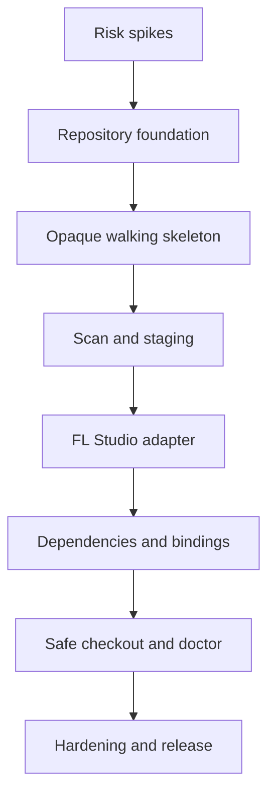

# DAWVC — MVP Implementation Plan

> **Document Version:** 1.0  
> **Status:** Approved implementation baseline  
> **Target Release:** MVP v0.1 public technical preview  
> **Normative Requirements:** `DAWVC_MVP_Requirements.md` v1.0  
> **Normative Architecture:** `DAWVC_Technical_Design.md` v1.1  
> **Team Model:** Single developer  
> **Estimation Unit:** Ideal engineering days, without calendar deadlines

---

# 1. Objective

This plan translates the MVP requirements into an executable development progression. The plan focuses on delivering early working vertical slices, demonstrable integrity, and controlled risk mitigation.

The first tangible result is not the complete dependency adapter, but a walking skeleton capable of committing a `.flp` project opaquely, visualizing it in commit history, and restoring it byte-identically. Inspection, dependencies, bindings, and diagnostics are integrated incrementally thereafter.

---

# 2. Foundational Principles & Constraints

- C# and .NET 10;
- Windows 11 x64 as the official MVP platform;
- CLI-only user interface;
- Public technical preview and portfolio-grade public GitHub repository;
- MIT License;
- One repository per logical musical project;
- Exactly one primary `.flp` per snapshot;
- FL Studio 2026.x as the baseline tested DAW version;
- Core engine DAW-independent from day one;
- BLAKE3 content-addressed identity;
- Immutable objects and atomic ref updates;
- Read-only FL Studio adapter;
- No FLP mutation, plugin loading, or automated modification of FL Studio configuration;
- Hybrid staging;
- No remote, server, desktop GUI, merge, or locking in v0.1;
- Self-contained Windows x64 ZIP distribution;
- Up to 5,000 tracked assets and 100 GB bundled content as the reference scale;
- Technical estimates expressed in ideal engineering days, not calendar dates.

---

# 3. Delivery Strategy

## 3.1 Vertical Slices

Every milestone must conclude with demonstrably executable behavior. Domain components are constructed only when an active use case directly consumes them.



## 3.2 Integrity-First

For object persistence, commit reference updates, and workspace checkout:

1. Happy-path test;
2. Failure-path test;
3. Fault-injection test;
4. CLI integration only after lower layers pass all integrity gates.

## 3.3 No Implicit Scope Creep

Any issue requiring remote synchronization, desktop GUI, semantic merging, native project writing, or a second DAW is deferred to the post-MVP backlog. Only changes strictly required to satisfy an approved Must requirement may expand the v0.1 scope.

---

# 4. Working Conventions

## 4.1 Definition of Ready for Implementation Tasks

A task is ready when:

- Linked requirement IDs are identified;
- Input, output, and failure behaviors are specified;
- Relevant domain invariants are defined;
- Test fixtures are available or planned as subtasks;
- No unresolved product decisions remain;
- Dependencies are completed or explicitly mockable.

## 4.2 Definition of Done for Implementation Tasks

A task is done when:

- Production code is reviewed or verified against a self-review checklist;
- Unit and relevant integration tests pass;
- Known failure modes are tested;
- Typed errors and diagnostic logging are implemented;
- Public or persisted contracts are documented;
- Requirement traceability is updated;
- Formatters, analyzers, and build pass with zero warnings;
- No temporary debug code, credentials, or commercial fixture content are present.

## 4.3 Branch and Commit Strategy

- `main` remains releasable at all times;
- Short-lived feature branches per issue;
- Conventional Commits (`feat`, `fix`, `docs`, `refactor`, `test`, `ci`, `chore`);
- Pull request template requiring requirement IDs and verification proof;
- Architecture Decision Record (ADR) required when modifying persisted formats, hashing, atomicity, or adapter boundaries.

---

# 5. Solution & Project Structure

The solution contains only projects strictly necessary for v0.1:

```text
src/
  DawVcs.Domain/
  DawVcs.Application/
  DawVcs.Infrastructure/
  DawVcs.Adapters.Abstractions/
  DawVcs.Adapters.FLStudio/
  DawVcs.Cli/

tests/
  DawVcs.Domain.Tests/
  DawVcs.Application.Tests/
  DawVcs.Infrastructure.Tests/
  DawVcs.Adapters.FLStudio.Tests/
  DawVcs.IntegrationTests/
  DawVcs.EndToEndTests/

fixtures/
  flstudio/
  repositories/

docs/
  technical-design.md
  mvp-requirements.md
  implementation-plan.md
  adr/
```

Reference direction:

```text
CLI ───────────────► Application ───────────────► Domain
Infrastructure ───► Application ports + Domain
FL Studio Adapter ► Adapter Abstractions + Domain contracts
Application ──────► Adapter Abstractions
```

Forbidden references:

- Domain → Infrastructure;
- Domain → CLI;
- Domain → FL Studio Adapter;
- FL Studio Adapter → CLI;
- Application → concrete Infrastructure implementations.

---

# 6. Milestone Overview

| Milestone | Deliverable | Work Packages | Estimate |
|---|---|---|---:|
| M0 — Feasibility | Critical technical risks proven or bounded | WP-00–WP-01 | 6–9 days |
| M1 — Opaque VCS | `.flp` init/commit/log/restore byte-identical | WP-02–WP-03 | 13–19 days |
| M2 — Working tree | Scan, hybrid staging, and status | WP-04 | 6–9 days |
| M3 — DAW awareness | Read-only FLP detection and validation | WP-05 | 8–12 days |
| M4 — Portability | Dependencies, bundling, and bindings | WP-06 | 8–12 days |
| M5 — Safe workflow | Checkout, branches, doctor, and fsck | WP-07–WP-08 | 14–20 days |
| M6 — Technical preview | Performance, security, packaging, and docs | WP-09–WP-10 | 12–18 days |

**Total Estimated Scale:** 67–99 ideal engineering days.

This estimate encompasses engineering, automated testing, and technical documentation. It excludes calendar buffers, marketing, long-term user support, or unforeseen reverse-engineering of unknown FLP binary structures.

---

# 7. WP-00 — Repository Bootstrap & Engineering Baseline

**Goal:** Establish a reproducible, strictly controlled development environment.

**Requirements:** `NFR-MNT-001` through `NFR-MNT-005`, `NFR-REL-003`, `NFR-REL-006`.

**Estimate:** 2–3 days.

## Tasks

- **IMP-0001:** Initialize Git repository with `main`, `.gitignore`, `.editorconfig`, and MIT license.
- **IMP-0002:** Create .NET 10 solution and projects from Chapter 5.
- **IMP-0003:** Enable nullable reference types, deterministic builds, and warnings-as-errors.
- **IMP-0004:** Configure code analyzers and formatter rules.
- **IMP-0005:** Set up xUnit test projects and shared test utilities.
- **IMP-0006:** Configure GitHub Actions for restore, build, test, and format on Windows.
- **IMP-0007:** Add supplementary Ubuntu runner job for pure Domain/Application tests to prevent unintended Windows coupling.
- **IMP-0008:** Add README skeleton, contributing guidelines, and pull request template.
- **IMP-0009:** Create `docs/adr/ADR-000-template.md` and initial ADR index.
- **IMP-0010:** Establish requirement traceability file or test trait convention.

## Exit Criteria

- Clean clone builds with zero manual intervention;
- All smoke and baseline tests pass on Windows;
- Domain and Application build cleanly on Ubuntu;
- Dependency rules enforced via architecture tests;
- Public repository contains zero secrets or licensed DAW content.

---

# 8. WP-01 — Risk & Feasibility Spikes

**Goal:** Bound uncertainties surrounding FLP inspection, BLAKE3, binary objects, and atomicity prior to writing production code.

**Requirements:** `FR-FLP-001` through `FR-FLP-012`, `FR-OBJ-001` through `FR-OBJ-010`, `NFR-INT-003` through `NFR-INT-005`.

**Estimate:** 4–6 days.

## Spike A — FLP Detection & Read-Only Inspection

- Assemble custom minimal FL Studio 2026.x test fixtures;
- Identify stable signatures, header structures, and version fields;
- Test empty project, single sample, audio recording, native plugin, and VST3 plugin;
- Document which sample paths and plugin identities are reliably readable;
- Test truncated, invalid extension, and unknown version fixtures;
- Prove via pre/post cryptographic hashes that inspection mutates zero source bytes;
- Document parser boundaries and fallback behavior in `ADR-ADP-001`.

## Spike B — BLAKE3 Library Selection

Selection criteria:

- Active maintenance and community adoption;
- Streaming API;
- Verification against official test vectors;
- Permissive license;
- Compatibility with .NET 10 and win-x64;
- Zero full-file buffering;
- Benchmark performance on multi-gigabyte WAV fixtures.

Document outcome in `ADR-HASH-001`.

## Spike C — Canonical Object Envelope

- Define magic bytes, field layout, endianness, and maximum lengths;
- Implement a disposable prototype reader/writer;
- Test truncation, invalid magic bytes, unknown version, length mismatch, and hash mismatch;
- Record exact 56-byte layout in `ADR-OBJ-001`.

## Spike D — Windows Atomic Replace Primitives

- Test atomic file materialization within the same NTFS volume;
- Test process termination before write, after flush, and before replace;
- Define recovery behavior if atomic replace is unavailable;
- Document chosen primitives in `ADR-IO-001`.

## Exit Criteria

- Go/no-go feasibility report for automated FLP dependency extraction;
- Unsupported/unknown fallback proven;
- Selected BLAKE3 implementation satisfies test vectors;
- Canonical object envelope frozen for schema v1;
- Safe-write primitive verified via fault injection;
- No spike code promoted to production without review and tests.

---

# 9. WP-02 — Domain Foundation & Object Store

**Goal:** Implement immutable identities, artifact model, and secure local content-addressed object store.

**Requirements:** `INV-001` through `INV-011`, `FR-OBJ-001` through `FR-OBJ-010`, `NFR-MNT-001`.

**Estimate:** 6–9 days.

## Tasks

- **IMP-0201:** Implement strongly typed IDs and value objects for repository, commit, snapshot, blob, asset, dependency, and adapter.
- **IMP-0202:** Implement `ContentHash` and streaming `IContentHasher`.
- **IMP-0203:** Model `ProjectArtifact`, `SingleFileArtifact`, `DirectoryArtifact`, `PackageArtifact`, and `ArchiveArtifact`.
- **IMP-0204:** Implement `ArtifactPath` canonicalizer with Unicode NFC normalization, `/`, traversal protection, and collision checks.
- **IMP-0205:** Implement deterministic aggregate hashing for artifact trees.
- **IMP-0206:** Implement object envelope reader/writer per `ADR-OBJ-001`.
- **IMP-0207:** Implement loose object store with temporary write, flush, hash verification, and atomic publish.
- **IMP-0208:** Implement deduplication and collision defense.
- **IMP-0209:** Implement JSON canonicalization and `schemaVersion` infrastructure.
- **IMP-0210:** Add object store fault injection hooks for testing.

## Test Suite

- Official BLAKE3 vectors;
- Empty and large streaming payloads;
- Duplicate blob handling;
- Same filename, different bytes;
- Truncated envelope;
- Unknown envelope version;
- Hash mismatch;
- Crash before atomic publish;
- Path normalization and case-collision;
- Deterministic aggregate hash regardless of filesystem enumeration order.

## Exit Criteria

- No object writer publishes incomplete content;
- Identical bytes deduplicate seamlessly;
- Object readers detect all modeled corruption modes;
- Domain has zero concrete filesystem dependencies;
- Artifact model represents all four container forms without DAW-specific types.

---

# 10. WP-03 — Opaque Walking Skeleton

**Goal:** Deliver initial end-to-end version control for a `.flp` project without dependency semantics.

**Requirements:** `FR-REP-001` through `FR-REP-010`, `FR-CFG-001` through `FR-CFG-004`, `FR-COM-001` through `FR-COM-011`, `FR-CHK-001` through `FR-CHK-007`, `AC-001`.

**Estimate:** 7–10 days.

## Vertical Use Case

```text
dawvc init
dawvc commit -m "Initial version"
dawvc log
dawvc checkout <commit> --restore-to <empty-folder>
```

## Tasks

- **IMP-0301:** Implement repository root discovery and `dawvc init` use case.
- **IMP-0302:** Implement `dawvc.yaml` schema v1 reader, validator, and writer.
- **IMP-0303:** Implement exact-one-primary-artifact selection.
- **IMP-0304:** Implement commit, snapshot, and reference domain objects.
- **IMP-0305:** Implement `HEAD`, `refs/heads/main`, and atomic reference updates.
- **IMP-0306:** Snapshot opaque primary project artifact.
- **IMP-0307:** Implement commit orchestration without adapter coupling.
- **IMP-0308:** Implement `log` query and CLI output rendering.
- **IMP-0309:** Implement read-only snapshot resolution and staged restore via `--restore-to`.
- **IMP-0310:** Build CLI shell with `System.CommandLine`, `Spectre.Console`, `--help`, `--version`, `--no-color`, and cancellation tokens.
- **IMP-0311:** Implement typed error infrastructure and process exit code mapping.
- **IMP-0312:** Automate end-to-end test for `AC-001`.

## Exit Criteria

- Custom `.flp` can be initialized, committed, and inspected via log;
- Restoration to an empty directory is byte-identical;
- Flow functions identically even when no DAW adapter is registered;
- Crash before reference update leaves `main` at the previous valid commit;
- No-op commits are cleanly rejected;
- CLI emits no unhandled stack traces for known domain errors.

---

# 11. WP-04 — Working Tree, Scan, Hybrid Staging & Status

**Goal:** Predictably manage workspace modifications and newly discovered assets.

**Requirements:** `FR-SCAN-008` through `FR-SCAN-012`, `FR-STG-001` through `FR-STG-010`, `NFR-PERF-004`, `NFR-PERF-007`.

**Estimate:** 6–9 days.

## Tasks

- **IMP-0401:** Implement SQLite local index and Dapper repositories in `.dawvc/index.db`.
- **IMP-0402:** Implement filesystem metadata cache for file identity, size, and timestamps.
- **IMP-0403:** Implement working-tree diffing against HEAD snapshot.
- **IMP-0404:** Automatically treat primary project artifact as tracked content.
- **IMP-0405:** Implement `scan` pipeline and scan result model.
- **IMP-0406:** Implement local staging index port and adapter.
- **IMP-0407:** Implement `add <path>`, `add --all`, and portability policy checks.
- **IMP-0408:** Implement `status` categories: staged, modified, added, removed, unresolved, and policy-blocked.
- **IMP-0409:** Implement content-based rename detection.
- **IMP-0410:** Test cancellation and crash recovery for scan/index operations.
- **IMP-0411:** Add warm status benchmark fixture.

## Exit Criteria

- New content is never silently committed;
- Tracked `.flp` and tracked assets track live workspace bytes;
- Status results are strictly deterministic;
- Corrupted local index is automatically rebuilt from repository and filesystem;
- Unchanged warm status satisfies sub-2-second performance baseline.

---

# 12. WP-05 — FL Studio Read-Only Adapter

**Goal:** Provide FLP format detection, health validation, and best-effort metadata extraction.

**Requirements:** `FR-SCAN-001` through `FR-SCAN-007`, `FR-FLP-001` through `FR-FLP-012`, `NFR-SEC-001`, `NFR-SEC-002`, `NFR-SEC-004`.

**Estimate:** 8–12 days.

## Tasks

- **IMP-0501:** Implement adapter abstractions and capability flags.
- **IMP-0502:** Implement `ArtifactReadContext` with read-only stream access.
- **IMP-0503:** Implement FL Studio 2026.x format policy.
- **IMP-0504:** Implement extension/signature/structure detection with confidence scoring.
- **IMP-0505:** Implement bounded binary reader with byte offsets, length guards, and cancellation.
- **IMP-0506:** Implement FLP version and project metadata extraction.
- **IMP-0507:** Implement structural validation statuses: `Valid`, `Suspicious`, `Invalid`, `Unsupported`, and `Unknown`.
- **IMP-0508:** Implement opaque fallback execution path.
- **IMP-0509:** Record `MetadataObservation` and data provenance.
- **IMP-0510:** Isolate adapter execution behind application ports and timeout policy.
- **IMP-0511:** Add golden manifests for the fixture test matrix.
- **IMP-0512:** Add pre/post hash tests proving strict read-only behavior.

## Fixture Test Matrix

```text
empty-project
single-sample
external-sample
missing-sample
recording
native-plugin
vst3-plugin
multiple-assets
renamed-sample
truncated-flp
wrong-extension
valid-extension-invalid-signature
unknown-newer-version
```

## Exit Criteria

- Adapter never declares `NativeWrite`, `NativeRoundTripValidation`, or `NativeMerge`;
- FL Studio 2026.x fixtures detected consistently;
- Unknown or newer versions safely degrade to opaque tracking;
- Truncated input causes no crashes or out-of-bounds reads;
- Cryptographic hash checks prove source bytes remain unaltered;
- Parser claims strictly limited to capabilities verified during Spike A.

---

# 13. WP-06 — Dependency Graph, Portability & Bundling

**Goal:** Model external project requirements as stable identities and securely persist bundlable assets.

**Requirements:** `FR-DEP-001` through `FR-DEP-015`, `FR-STG-004` through `FR-STG-006`, `AC-002` through `AC-006`.

**Estimate:** 8–12 days.

## Tasks

- **IMP-0601:** Implement dependency aggregate and graph validation.
- **IMP-0602:** Implement `AssetDependency`, `PluginDependency`, `PluginContentDependency`, and `EnvironmentDependency`.
- **IMP-0603:** Implement portability modes and default policy engine.
- **IMP-0604:** Map sample and recording references from adapter output to dependencies.
- **IMP-0605:** Implement plugin identity normalization for verified formats.
- **IMP-0606:** Implement unknown/user-assisted plugin content registration.
- **IMP-0607:** Implement bundling preview displaying policy decisions and byte volume.
- **IMP-0608:** Implement required vs. optional dependency status and incomplete snapshot tagging.
- **IMP-0609:** Implement commit blocking when required Bundle dependencies are missing.
- **IMP-0610:** Implement `--allow-incomplete` override flag.
- **IMP-0611:** Test deduplication across dependencies and file renames.
- **IMP-0612:** Add license policy and commercial asset rejection tests.

## Exit Criteria

- Assets with identical bytes share a single content-addressed blob;
- Plugins are never bundled or executed;
- Newly discovered external dependencies require explicit staging;
- Missing Bundle dependencies block commits unless explicitly overridden;
- `ReferenceOnly` dependencies do not block commit creation;
- Every inferred dependency maintains provenance and confidence metrics.

---

# 14. WP-07 — Bindings, Safe Checkout & Recovery

**Goal:** Reliably reconstruct snapshots across different host directory structures.

**Requirements:** `FR-BND-001` through `FR-BND-009`, `FR-CHK-001` through `FR-CHK-015`, `AC-009` through `AC-013`.

**Estimate:** 7–10 days.

## Tasks

- **IMP-0701:** Implement local `DependencyBinding` persistence.
- **IMP-0702:** Implement deterministic dependency resolver pipeline.
- **IMP-0703:** Implement hash verification and mismatch reporting.
- **IMP-0704:** Implement user-selected binding interactive flow.
- **IMP-0705:** Implement managed asset root and materialization layout.
- **IMP-0706:** Implement full checkout staging on the same filesystem volume.
- **IMP-0707:** Implement post-materialization entry and aggregate hash validation.
- **IMP-0708:** Implement atomic install and dirty working tree guards.
- **IMP-0709:** Implement `--restore-to <dir>` export workflow.
- **IMP-0710:** Implement `--force` with automated recovery backup and report generation.
- **IMP-0711:** Add guards for path traversal, duplicate normalized paths, symlinks, and case collisions.
- **IMP-0712:** Implement post-checkout diagnostic report with managed asset root guidance and manual FL Studio relinking steps.
- **IMP-0713:** Add process-kill and fault injection tests for each publication phase.

## Exit Criteria

- Normal checkout with dirty changes modifies zero bytes on disk;
- `--restore-to` executes cleanly without altering the active workspace;
- `--force` reliably creates an intact recovery backup before modifying files;
- Failed staged checkout is never published to the active tree;
- Path bindings remain strictly local and unversioned;
- Computer B reconstructs all bundled assets and receives actionable FL Studio search-path instructions.

---

# 15. WP-08 — Branches, Diagnostics (Doctor) & Integrity (Fsck)

**Goal:** Provide branch navigation and transparent system health diagnostics.

**Requirements:** `FR-BRA-001` through `FR-BRA-007`, `FR-DOC-001` through `FR-DOC-010`, `FR-FSC-001` through `FR-FSC-008`, `FR-CLI-005`, `FR-ERR-001` through `FR-ERR-004`.

**Estimate:** 7–10 days.

## Tasks

- **IMP-0801:** Implement branch creation, listing, and reference validation.
- **IMP-0802:** Implement `switch` utilizing the safe checkout pipeline.
- **IMP-0803:** Implement artifact health, dependency health, and environment health diagnostic models.
- **IMP-0804:** Implement local FL Studio installation detection where reliably possible.
- **IMP-0805:** Scan plugin installations and verify version compatibility without loading binaries.
- **IMP-0806:** Implement human-readable `doctor` terminal report.
- **IMP-0807:** Implement `doctor --json` with stable output schema.
- **IMP-0808:** Implement `fsck` object graph traversal and hash validation.
- **IMP-0809:** Implement `fsck --artifacts` with deep artifact validation.
- **IMP-0810:** Implement `fsck --json`.
- **IMP-0811:** Verify exit codes and remediation messages across all diagnostic states.
- **IMP-0812:** Add repository corruption test fixtures.

## Exit Criteria

- Branch switching cannot silently overwrite uncommitted workspace modifications;
- `doctor` clearly differentiates blocking errors from non-blocking warnings;
- `fsck` cleanly distinguishes object store corruption, invalid native artifacts, and adapter inspection failures;
- JSON contracts pass golden compatibility tests;
- `fsck` never performs automated or destructive repairs.

---

# 16. WP-09 — Performance, Security & Resilience Hardening

**Goal:** Validate the feature-complete MVP against all non-functional requirements.

**Requirements:** `NFR-INT-001` through `NFR-INT-008`, `NFR-PERF-001` through `NFR-PERF-008`, `NFR-SEC-001` through `NFR-SEC-009`, `NFR-CMP-001` through `NFR-CMP-005`.

**Estimate:** 8–12 days.

## Tasks

- **IMP-0901:** Generate 5,000 synthetic audio assets reference repository.
- **IMP-0902:** Benchmark streaming scan, commit, and checkout across up to 100 GB generated test data.
- **IMP-0903:** Perform memory profiling to eliminate unexpected buffering.
- **IMP-0904:** Optimize warm status path and add regression benchmark tests.
- **IMP-0905:** Configure and benchmark bounded concurrency limits.
- **IMP-0906:** Implement property/fuzz tests for object envelope, path canonicalizer, and FLP reader.
- **IMP-0907:** Harden parser timeouts, maximum payload lengths, and cancellation handling.
- **IMP-0908:** Review path redaction and structured logging for privacy compliance.
- **IMP-0909:** Finalize fault injection for commit, index, and checkout transactions.
- **IMP-0910:** Validate execution on a clean Windows 11 virtual machine.
- **IMP-0911:** Perform NuGet dependency and license compliance audit.
- **IMP-0912:** Update threat model checklist with validated mitigations.

## Exit Criteria

- 5,000-asset fixture commits and checks out successfully end-to-end;
- 100 GB streaming path operates without buffering entire files;
- Peak memory usage remains comfortably below 512 MB;
- Unchanged warm status completes in under 2 seconds on reference SSD;
- All parser and path fuzzing tests terminate gracefully without unhandled exceptions;
- Fault injection damages zero reachable repository state;
- Deviations from Should-level performance targets documented as known limitations.

---

# 17. WP-10 — Packaging, Documentation & Public Technical Preview

**Goal:** Publish an installable, comprehensive, and legally unencumbered v0.1 release.

**Requirements:** `NFR-REL-001` through `NFR-REL-008` and Chapter 27 release gate criteria.

**Estimate:** 4–6 days.

## Tasks

- **IMP-1001:** Establish version numbering and prerelease convention (e.g., `0.1.0-preview.1`).
- **IMP-1002:** Create self-contained `win-x64` publish profile.
- **IMP-1003:** Produce ZIP distribution package and compute SHA-256 checksums.
- **IMP-1004:** Author installation and uninstallation guides.
- **IMP-1005:** Author Quick Start tutorial (init → scan → add → commit → doctor → restore).
- **IMP-1006:** Author documentation for `doctor`, FL Studio search folders, and manual relinking.
- **IMP-1007:** Author recovery guide for dirty and forced checkouts.
- **IMP-1008:** Document known limitations, privacy boundaries, security model, and licensing.
- **IMP-1009:** Generate and verify CLI command reference.
- **IMP-1010:** Execute smoke test on clean VM without .NET runtime pre-installed.
- **IMP-1011:** Publish Software Bill of Materials (SBOM) and dependency inventory.
- **IMP-1012:** Execute release checklist and publish GitHub prerelease.

## Exit Criteria

- Self-contained ZIP runs on a pristine Windows 11 x64 machine;
- Users can execute the complete walking skeleton workflow from documentation alone;
- Cryptographic checksums are published and verified;
- README explicitly clarifies that `.flp` files are never rewritten and manual relinking may be needed;
- Repository and fixtures adhere 100% to MIT and licensing policies;
- All Must requirements possess verifiable automated test proof.

---

# 18. Requirement Traceability Matrix

| Work Package | Primary Requirement Groups |
|---|---|
| WP-00 | NFR-MNT, NFR-REL |
| WP-01 | FR-FLP, FR-OBJ, NFR-INT |
| WP-02 | INV, FR-OBJ, NFR-MNT |
| WP-03 | FR-REP, FR-CFG, FR-COM, basic FR-CHK |
| WP-04 | FR-SCAN, FR-STG, NFR-PERF |
| WP-05 | FR-FLP, FR-SCAN, NFR-SEC |
| WP-06 | FR-DEP, FR-STG, AC-002–AC-006 |
| WP-07 | FR-BND, FR-CHK, AC-009–AC-013 |
| WP-08 | FR-BRA, FR-DOC, FR-FSC, FR-ERR |
| WP-09 | NFR-INT, NFR-PERF, NFR-SEC, NFR-CMP |
| WP-10 | NFR-REL and MVP Release Gate |

Every pull request must reference at least one concrete requirement ID. A single requirement may be covered across multiple tasks and testing tiers.

---

# 19. Testing Strategy

## 19.1 Testing Layers

| Layer | Objective | Examples |
|---|---|---|
| Unit | Pure invariants and value objects | Hash identity, path normalization, policies, graph validation. |
| Property/fuzz | Unexpected inputs and permutations | Object envelope, FLP reader, canonical paths. |
| Golden | Deterministic adapter and JSON output | Fixture → expected manifest/report. |
| Integration | Ports interacting with filesystem / SQLite | Object store, index, commit, checkout, binding persistence. |
| Fault injection | Crash consistency and resilience | Process kills before/after flush, ref updates, atomic install. |
| End-to-end | Real-world CLI invocations | Machine A commit → Machine B restore / doctor. |
| Performance | Baselines and regression tracking | 5,000 assets, warm status, 100 GB streaming I/O. |
| Packaging | Pristine machine verification | Self-contained ZIP without .NET runtime installed. |

## 19.2 Fixture Guidelines

- Fixtures are minimal, focused, and synthetic;
- `.flp` fixtures are authored directly by the project maintainers;
- Audio samples are synthetic or royalty-free recordings;
- No commercial plugin binaries or copyrighted sample libraries are ever committed;
- Every fixture includes a README/manifest documenting expected properties;
- Fixture versions are immutable; modifications yield a new fixture version;
- Corrupted fixtures are derived systematically from verified baseline fixtures.

## 19.3 Critical Fault Injection Injection Points

```text
Object write
├── before temp create
├── during payload streaming
├── before flush
├── after flush / before rename
└── after rename

Commit
├── after blobs
├── after manifests
├── after snapshot
├── after commit
└── before / after ref update

Checkout
├── during staging
├── before candidate verification
├── after verification
├── during recovery copy
└── before / after atomic install
```

---

# 20. CI/CD Architecture

## Pull Request Pipeline

1. Restore with locked dependencies;
2. Code formatting verification (`dotnet format --verify-no-changes`);
3. Build with warnings-as-errors;
4. Unit and architecture tests;
5. Adapter fixture and golden tests;
6. Integration tests with temporary isolated repositories;
7. Fast fuzz and smoke test suite;
8. Dependency and license audit check.

## Nightly / Extended Pipeline

- Complete fault injection matrix;
- Extended fuzzing tests;
- 5,000-asset performance benchmark;
- Multi-gigabyte streaming I/O validation;
- Clean-VM packaging smoke test;
- Artifact checksums and SBOM generation.

## Release Pipeline

- Triggered by release tag (`v*`) or manual `workflow_dispatch`;
- Full Windows test suite must pass;
- Self-contained win-x64 compilation;
- Automated ZIP packaging and SHA-256 calculation;
- Automated release notes generation and categorization;
- Prerelease tagging and publication.

---

# 21. Risk Register

| ID | Risk | Likelihood | Impact | Mitigation | Review Milestone |
|---|---|---:|---:|---|---|
| R-001 | FLP format is insufficiently documented for reliable dependency extraction. | High | High | Spike A, bounded parser, provenance tracking, opaque fallback. | WP-01 |
| R-002 | Sample paths are detected, but FL Studio does not locate materialized files automatically. | High | Medium | Managed asset root, doctor instructions, explicit documentation. | WP-07 |
| R-003 | Plugin identities vary across formats and versions. | Medium | Medium | Normalize only verified formats; preserve raw native ID. | WP-06 |
| R-004 | Large audio files cause memory or throughput degradation. | Medium | High | Streaming I/O buffers, bounded concurrency, benchmarks. | WP-02/WP-09 |
| R-005 | Atomic file replace behaves inconsistently on specific NTFS configurations. | Medium | High | NTFS spike, same-volume staging, recovery rollback. | WP-01/WP-07 |
| R-006 | SQLite index database becomes corrupt or out-of-sync. | Low | Medium | Index is a rebuildable cache; repository object store is ground truth. | WP-04 |
| R-007 | Public fixtures accidentally include copyrighted content. | Medium | High | Strictly synthetic assets; license scans and release checklist. | Continuous |
| R-008 | Scope expands toward remote sync, GUI, or semantic merging. | High | Medium | Explicit out-of-scope boundaries and post-MVP backlog. | Every review |
| R-009 | Public JSON schema changes destabilize integrations. | Medium | Medium | `schemaVersion`, golden tests, ADRs, prerelease designation. | WP-02/WP-08 |
| R-010 | Forced checkout inadvertently loses uncommitted user data. | Low | Critical | Automated recovery backup prior to install; zero silent overwrites. | WP-07 |

---

# 22. Initial Execution Sequence

Upon approval of this baseline, the initial work progression was executed in this order:

1. **IMP-0001 — Repository and MIT baseline.**
2. **IMP-0002 — .NET 10 solution skeleton.**
3. **IMP-0003 — Build, analyzer, and warning policy.**
4. **IMP-0005 — Test projects and testing conventions.**
5. **IMP-0006 — Windows CI pipeline activation.**
6. **IMP-0009 — ADR template and registry index.**
7. **SPIKE-ADP-001 — Custom FL Studio 2026.x fixture matrix and inspection.**
8. **SPIKE-HASH-001 — BLAKE3 library benchmark and validation.**
9. **SPIKE-OBJ-001 — Object envelope design and corruption validation.**
10. **SPIKE-IO-001 — NTFS atomic replace and fault injection prototype.**

Permanent object store and adapter implementation proceeded only after WP-01 achieved its exit criteria.

---

# 23. Technical Decision Protocol

Not every implementation detail requires a formal product amendment. Apply this decision protocol:

- **ADR Required:** Persisted format, public CLI/JSON contract, hashing algorithm, identity model, atomicity guarantee, adapter capability, or security boundary changes.
- **Requirements Amendment Required:** Visible product behavior, feature scope, acceptance criteria, or external guarantees change.
- **Normal Implementation Choice:** Internal algorithm or library update without modifying public or persisted contracts.

When requirements change, `DAWVC_MVP_Requirements.md` must be amended prior to code updates. When architecture changes, the Technical Design and ADR index must be updated first.

---

# 24. Public Technical Preview Release Checklist

## Functionality
- [ ] All 12 v0.1 commands operational with `--help`.
- [ ] Opaque `.flp` commit and restore verified byte-identical.
- [ ] Hybrid staging operational with zero silent auto-staging.
- [ ] Dependency bundling and content deduplication verified.
- [ ] Incomplete commits blocked unless overridden by `--allow-incomplete`.
- [ ] Branch and switch execute via safe checkout pipeline.
- [ ] `doctor` and `fsck` strictly separate health domains.
- [ ] `--restore-to` and `--force` automated recovery copies operational.

## Integrity & Security
- [ ] Object, commit, and checkout fault injection tests pass.
- [ ] Path traversal, symlink escape, and collision guards validated.
- [ ] Adapter executes strictly read-only with zero binary execution.
- [ ] Unknown versions safely degrade to opaque snapshotting.
- [ ] Logs contain zero secrets and automatically redact user paths.

## Quality
- [ ] Unit, golden, integration, and end-to-end test suites pass.
- [ ] Clean Windows 11 virtual machine execution verified.
- [ ] Performance baselines measured and documented.
- [ ] Public JSON schemas pass golden compatibility tests.

## Distribution
- [ ] MIT License present.
- [ ] README and Quick Start guide verified.
- [ ] Known limitations document FL Studio search paths and relinking.
- [ ] Test fixtures confirmed royalty-free and synthetic.
- [ ] Self-contained win-x64 ZIP runs without .NET runtime installed.
- [ ] SHA-256 checksums published.
- [ ] Release version and release notes consistent.

---

# 25. Post-MVP Backlog

The following items are recognized but explicitly deferred beyond v0.1:

- Remote object negotiation, synchronization protocol, and central server;
- `dawvc clone`, `fetch`, `push`, and `pull`;
- User authentication, role-based authorization, and project locking;
- Desktop GUI client (Avalonia UI);
- Semantic diffing and capability-based project merging;
- Automated FL Studio search path configuration (with explicit user consent);
- Zipped FL Studio project archives (`.flp` inside `.zip`);
- Native adapter writing with round-trip verification;
- Additional DAW adapters (Ableton Live, Logic Pro, Studio One, Reaper);
- Collaboration snapshot manifests;
- Zstandard compression for objects;
- Content-defined chunking (CDC) and partial sparse checkout;
- Garbage collection and object packfiles;
- Project tags and release references;
- Automatic update checks and opt-in crash telemetry.

This backlog will be prioritized only after achieving the v0.1 MVP release gate.
