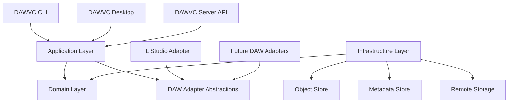
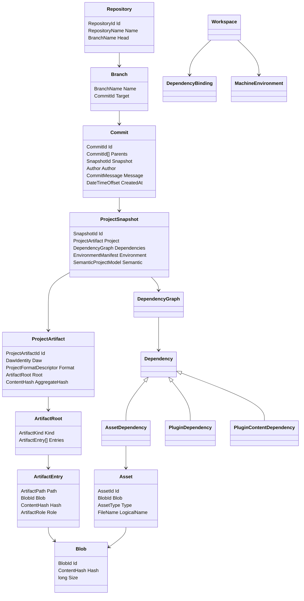
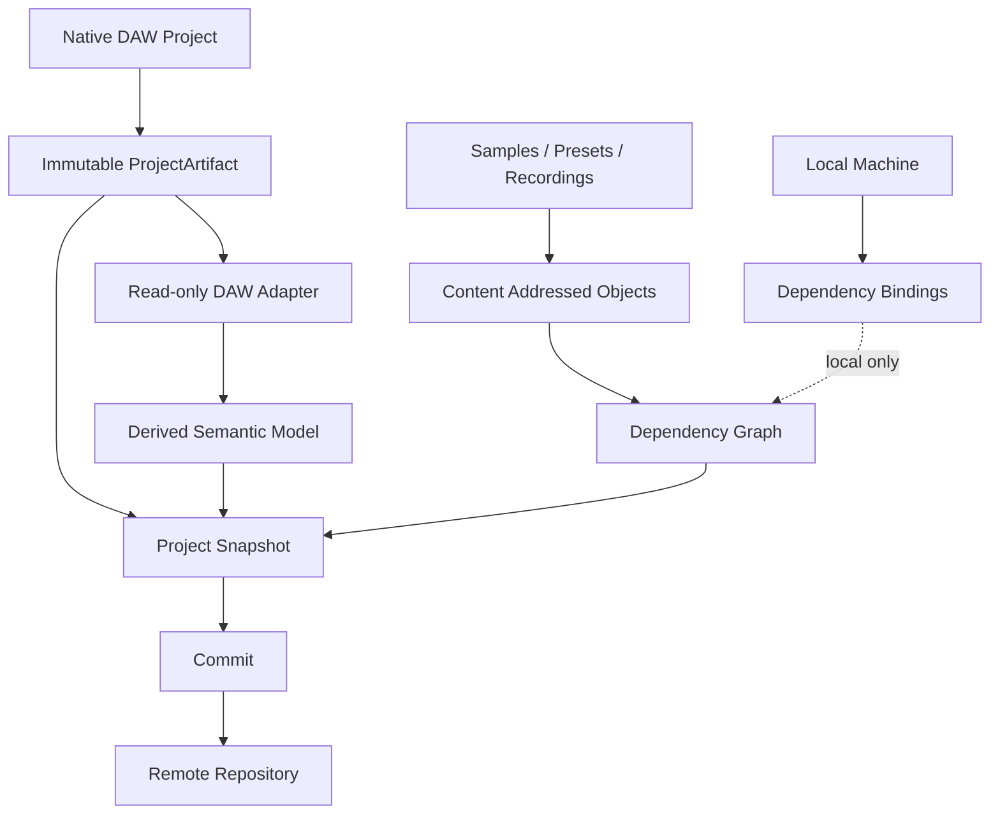

# DAW Version Control — Technical Design

> **Working Name:** DAWVC  
> **Document Version:** 1.1  
> **Status:** Normative Technical Design / Implementation Baseline  
> **Primary Implementation:** C# / .NET 10 LTS  
> **Initial DAW Adapter:** FL Studio 2026.x  
> **Target Platforms:** Windows 11 x64 initially, subsequent macOS/Linux where applicable  

> **Revision Note (v1.1):** Generic artifact-tree container model, read-only adapters by default, distinct integrity tiers, and staged/atomic native artifact handling.

---

# 1. Executive Summary

DAWVC is a dedicated version control and dependency management platform engineered for Digital Audio Workstation (DAW) projects.

The architecture synthesizes four core responsibilities:

1. **Version Control** for native DAW project files and physical audio assets.
2. **Dependency Management** for samples, recordings, presets, third-party plugins, wavetables, and external sound libraries.
3. **Environment Validation** to deterministically verify whether a project can be faithfully reproduced on a different host workstation.
4. **Collaboration** through branches, commits, remotes, optimistic/pessimistic locking, and portable cross-DAW collaboration snapshots.

The core engine is strictly **DAW-agnostic**. Image-Line FL Studio serves as the initial reference adapter. Other DAWs—such as Ableton Live, Logic Pro, Cubase, REAPER, or Bitwig Studio—integrate seamlessly via identical adapter contracts.

Native DAW projects are not modeled exclusively as single monolithic files. A project artifact can take the form of a single file, directory, bundle/package, or archive. Original native project bytes represent primary ground truth; inspection metadata and semantic models are rebuildable, derived observations.

The foundational design axiom is:

> **"A dependency is identified by its content or logical identity, NEVER by its local filesystem path."**

Local filesystem paths, plugin installation directories, and sample library roots are machine-local bindings and are never persisted as shared project identity.

---

# 2. Problem Statement

DAW projects are notoriously non-portable across systems.

A given project inherently relies upon:

- The native DAW project file;
- Audio samples and one-shots;
- Multitrack audio recordings and vocal stems;
- Rendered stems;
- MIDI sequences;
- Plugin presets and channel states;
- Impulse responses (convolution reverb);
- Custom synthesizer wavetables;
- Serialized plugin state blobs;
- Third-party plugin binaries (VST3, AU, CLAP, AAX);
- Specific plugin version releases;
- External sample libraries (e.g. Kontakt, Decent Sampler);
- DAW versions and patch levels;
- Machine-specific directory hierarchies;
- DAW search paths and extra browser folders;
- Operating-system-specific plugin installation directories.

Consequently, a project that functions flawlessly on Workstation A frequently opens on Workstation B plagued by:

- Missing audio samples and unlinked stems;
- Missing third-party plugins;
- Version mismatch degradation (projects saved on newer plugin versions crashing older builds);
- Missing synthesizer presets and wavetable references;
- Unresolved absolute filesystem paths (`D:\Samples\Kick.wav` vs `C:\Audio\Kick.wav`);
- Silent sample substitution or altered audio bytes;
- Complete loss of dependency context.

Traditional version control systems like Git solve this only superficially. Git versions arbitrary byte streams, but lacks domain awareness: it cannot determine why a sample is required, what plugin is missing, or whether a local file is identical in content to an unresolved dependency.

DAWVC supplies that missing domain intelligence.

---

# 3. Product Objectives

## 3.1 Primary Goals

DAWVC must:

- Reliably version DAW projects without corrupting native project files;
- Store audio assets and blobs in a content-addressed storage layer;
- Deduplicate identical audio assets across branches, projects, and directories;
- Automatically detect referenced audio dependencies;
- Decouple dependency identity from host filesystem paths;
- Capture project metadata and environment requirements;
- Model third-party plugins as requirements without redistributing commercial plugin binaries;
- Safely materialize projects on secondary workstations;
- Transparently diagnose why a project cannot be reproduced locally;
- Support multi-user branching and collaboration workflows;
- Provide parity across CLI and desktop interfaces;
- Accommodate diverse DAW platforms without modifying the core domain;
- Store, validate, and restore native artifacts without in-place mutation;
- Support single-file, directory, package, and archive project layouts;
- Safely version unrecognized or future project formats as opaque artifacts.

## 3.2 Secondary Goals (Post-MVP)

Subsequent milestones will introduce:

- Semantic visual diffing;
- Cross-DAW collaboration snapshots (stems, MIDI, tempo maps, markers);
- Partial checkout and on-demand lazy asset retrieval;
- Content-defined chunking (CDC) for multi-gigabyte audio assets;
- Dynamic third-party DAW adapter plugins.

---

# 4. Non-Goals for MVP v0.1

MVP v0.1 explicitly excludes:

- Automated semantic merging of native DAW project files;
- Real-time collaborative DAW editing;
- Lossless format conversion between FL Studio, Ableton, Logic, or REAPER;
- Bundling or redistribution of commercial plugin binaries;
- Bypassing software licensing or Digital Rights Management (DRM);
- Central cloud hosting as a mandatory prerequisite;
- Heuristic scanning of proprietary third-party sample library databases;
- Content-defined chunking (CDC);
- Delta compression on raw audio files;
- In-depth mixer, pattern, or MIDI event diffing.

---

# 5. Architectural Principles

## 5.1 DAW-Agnostic Core

The core domain layer contains zero knowledge of `FlStudioProject`, `AbletonProject`, or `LogicProject`.

The core operates solely on generic domain concepts:

- Repository
- Commit
- Snapshot
- ProjectArtifact
- Dependency
- Asset
- Blob
- PluginRequirement
- Workspace
- DependencyBinding
- Environment
- AdapterCapability

DAW-specific semantics are encapsulated entirely inside interchangeable adapters.

## 5.2 Strict Separation of Shared vs. Local State

### Shared / Versioned State (Committed)
- Commits;
- Snapshots;
- Dependency graphs;
- Project artifacts;
- Assets;
- Content hashes (BLAKE3);
- Plugin requirements;
- Semantic project metadata;
- Portability policies.

### Local / Unversioned State (Workstation-Bound)
- Absolute filesystem paths;
- Host plugin installation folders;
- Local sample libraries;
- Workstation hardware configuration;
- Local dependency path bindings;
- Credentials and authentication tokens;
- Index and metadata caches.

## 5.3 Paths are Locators, Never Identifiers

```text
Dependency Identity != Local Filesystem Path
```

Example:

```text
Asset Identity:
BLAKE3:a72f192b49...

Machine A Locator:
D:\Samples\Kicks\kick.wav

Machine B Locator:
C:\Audio\Hardcore\kick.wav
```

Both paths bind to the exact same cryptographic dependency identity.

## 5.4 Immutable History

Commits, snapshots, manifests, and blobs are strictly immutable. Workspace modifications yield brand new content-addressed objects.

## 5.5 Content-Addressed Storage

Binary payloads are addressed exclusively by cryptographic hashes:
- **BLAKE3** serves as the primary hash for blob and artifact identity.
- **SHA-256** is retained optionally for external interoperability and export verification.

## 5.6 Capability-Based Adapters

Not all DAWs expose equivalent APIs or file structures. Adapters explicitly declare supported capabilities via bitmask flags.

## 5.7 Metadata Provenance

Derived metadata must record:
- Observation source;
- Confidence score;
- Timestamp of inspection;
- Adapter version.

Inferred metadata is never presented as ground truth extracted directly from the native project.

## 5.8 Native Bytes Represent Primary Truth

A `SemanticProjectModel`, dependency graph, or validation report never replaces the original native project artifact. Derived models can be recomputed by newer adapters without altering committed bytes.

A parser failure does not imply repository corruption. DAWVC maintains strict separation between:
- Object store integrity;
- Artifact tree integrity;
- Native format validity;
- Adapter compatibility.

## 5.9 Read-Only Adapters & Safe Writes

Adapters operate read-only by default. Native project writing requires an explicit, separate capability.

DAWVC never overwrites an existing project file in-place. All writes employ a staged candidate, validation, hash verification, durable disk flush, and atomic replace.

---

# 6. High-Level Architecture



---

# 7. Solution Structure

```text
src/
  DawVcs.Domain/
    Repositories/
    Commits/
    Snapshots/
    Dependencies/
    Assets/
    Plugins/
    Workspaces/
    Environments/
    Collaboration/
    Artifacts/
    Validation/

  DawVcs.Application/
    Commands/
    Queries/
    Services/
    UseCases/
    Ports/

  DawVcs.Infrastructure/
    FileSystem/
    Persistence/
    Hashing/
    Compression/
    ObjectStorage/
    Networking/
    Configuration/

  DawVcs.Adapters.Abstractions/
    IDawAdapter.cs
    AdapterCapabilities.cs
    ProjectInspection.cs
    ProjectFormatDescriptor.cs
    ArtifactValidationResult.cs

  DawVcs.Adapters.FLStudio/
    Detection/
    Formats/
    Inspection/
    DependencyScanning/
    Metadata/
    Validation/
    FlpParsing/

  DawVcs.Cli/

  DawVcs.Desktop/

  DawVcs.Server/

tests/
  DawVcs.Domain.Tests/
  DawVcs.Application.Tests/
  DawVcs.Infrastructure.Tests/
  DawVcs.Adapters.FLStudio.Tests/
  DawVcs.IntegrationTests/
  DawVcs.EndToEndTests/
```

---

# 8. Bounded Contexts

## 8.1 Version Control
Manages repositories, references (`HEAD`, branches, tags), commits, snapshots, and DAG history.

## 8.2 Content Store
Manages blobs, cryptographic hashing, content deduplication, loose object storage, envelopes, and chunk streaming.

## 8.3 Dependency Management
Manages asset dependencies, plugin dependencies, plugin content, dependency graphs, portability policies, and resolution status.

## 8.4 Workspace
Manages working trees, local dependency path bindings, host machine environments, filesystem scanning, status calculation, and checkout materialization.

## 8.5 DAW Integration
Manages format detection, read-only dependency extraction, metadata parsing, format descriptors, and structural validation.

## 8.6 Collaboration (Post-MVP)
Manages user identities, project permissions, optimistic/pessimistic locks, activity feeds, and remote synchronization.

## 8.7 Cross-DAW Exchange (Post-MVP)
Manages collaboration snapshots, stems, MIDI tracks, tempo maps, and universal exchange representations.

---

# 9. Domain Model

## 9.1 Overview



---

# 10. Aggregates

## 10.1 Repository Aggregate

```csharp
public sealed class Repository
{
    public RepositoryId Id { get; }
    public RepositoryName Name { get; }
    public BranchName Head { get; private set; }

    private readonly Dictionary<BranchName, CommitId> _branches;
    private readonly Dictionary<TagName, CommitId> _tags;
}
```

### Invariants
- `HEAD` points to a valid branch or detached commit.
- A branch reference always resolves to an existing commit.
- Commit objects are immutable once written.
- Tag references are immutable unless explicitly force-updated.

## 10.2 ProjectSnapshot Aggregate

```csharp
public sealed class ProjectSnapshot
{
    public SnapshotId Id { get; }
    public ProjectArtifact Project { get; }
    public DependencyGraph Dependencies { get; }
    public EnvironmentManifest Environment { get; }
    public SemanticProjectModel? Semantic { get; }
}
```

A snapshot captures the complete, self-contained state of a project at a specific point in time.

### Invariants
- Every bundled asset references an existing, valid blob in object storage.
- Every dependency possesses a stable, path-independent identity.
- Local absolute paths are never persisted in shared snapshot identities.
- The artifact root conforms to the detected `ProjectFormatDescriptor`.
- Artifact paths are normalized, relative, and free of path traversal sequences (`..`).
- The aggregate hash is deterministically derived from container type, normalized paths, roles, and entry hashes.
- Original native artifact bytes represent primary truth; metadata never replaces raw bytes.
- Snapshot contents never change post-commit.

## 10.3 Workspace Aggregate

```csharp
public sealed class Workspace
{
    public WorkspaceId Id { get; }
    public RepositoryId Repository { get; }
    public WorkspacePath Root { get; }

    public MachineEnvironment Environment { get; private set; }
    public WorkingTree WorkingTree { get; private set; }

    private readonly Dictionary<DependencyId, DependencyBinding> _bindings;
}
```

### Invariants
- Local bindings are stored outside repository commits in local configuration (`.dawvc/index.db`).
- Bindings are marked `Verified` only after cryptographic hash verification.
- Workspace status is derived from comparing working tree state against HEAD snapshot.

## 10.4 DependencyGraph Aggregate

```csharp
public sealed class DependencyGraph
{
    public IReadOnlyCollection<DependencyNode> Nodes { get; }
    public IReadOnlyCollection<DependencyEdge> Edges { get; }
}
```

The dependency graph records not merely **what** is required, but **why** it is required (e.g. Channel "Kick" → `kick.wav`, Mixer Insert 1 → FabFilter Pro-Q 3).

---

# 11. Entities and Value Objects

## 11.1 Blob

```csharp
public sealed record Blob(
    BlobId Id,
    ContentHash Hash,
    long Size,
    CompressionType Compression);
```

A blob encapsulates raw content identity and size without filesystem paths.

## 11.2 ProjectArtifact & Artifact Tree

```csharp
public sealed record ProjectArtifact(
    ProjectArtifactId Id,
    DawIdentity Daw,
    ProjectFormatDescriptor Format,
    ArtifactRoot Root,
    ContentHash AggregateHash);
```

`ArtifactRoot` accommodates diverse project packaging forms:

```csharp
public abstract record ArtifactRoot(ArtifactKind Kind);

public sealed record SingleFileArtifact(ArtifactEntry File)
    : ArtifactRoot(ArtifactKind.SingleFile);

public sealed record DirectoryArtifact(IReadOnlyCollection<ArtifactEntry> Entries)
    : ArtifactRoot(ArtifactKind.Directory);

public sealed record PackageArtifact(IReadOnlyCollection<ArtifactEntry> Entries)
    : ArtifactRoot(ArtifactKind.Package);

public sealed record ArchiveArtifact(
    ArtifactEntry Archive,
    IReadOnlyCollection<ArchiveIndexEntry>? InspectedEntries)
    : ArtifactRoot(ArtifactKind.Archive);
```

| DAW / Project Format | ArtifactRoot | Notes |
|---|---|---|
| FL Studio `.flp` | `SingleFileArtifact` | Native monolithic project file; external dependencies stored in graph. |
| FL Studio Zipped Project | `ArchiveArtifact` | Archive blob preserved intact; internal files indexed read-only. |
| Ableton Live Project Folder | `DirectoryArtifact` | `.als` file, sample recordings, and project subdirectories. |
| Logic Pro Package | `PackageArtifact` | Directory presented as a document by macOS versioned as a tree. |
| REAPER `.rpp` | `SingleFileArtifact` | Text-based native project versioned immutably. |

```csharp
public sealed record ArtifactEntry(
    ArtifactPath Path,
    BlobId Blob,
    ContentHash Hash,
    ArtifactRole Role,
    UnixFileMode? Mode = null);
```

Directories are inferred deterministically from entry paths. `ArtifactPath` is strictly relative. Path traversal (`..`), absolute roots, and symlinks are prohibited.

```csharp
public enum ArtifactRole
{
    PrimaryProjectFile,
    ProjectMetadata,
    ProjectAsset,
    Cache,
    Generated,
    Unknown
}
```

## 11.3 ProjectFormatDescriptor

```csharp
public sealed record ProjectFormatDescriptor(
    FormatId Id,
    DawIdentity Daw,
    ArtifactKind Container,
    FormatVersion? Version,
    IReadOnlyCollection<FileExtension> Extensions,
    ProjectFormatCapabilities Capabilities);
```

Format detection inspects extensions, magic headers, structural chunks, and version events.

## 11.4 Asset

```csharp
public sealed record Asset(
    AssetId Id,
    BlobId Blob,
    AssetType Type,
    FileName LogicalName,
    MediaMetadata? Media);
```

```csharp
public enum AssetType
{
    Sample,
    Recording,
    Stem,
    Preset,
    Midi,
    Score,
    ImpulseResponse,
    Wavetable,
    PluginState,
    Render,
    Artwork,
    Other
}
```

## 11.5 Dependency & Subtypes

```csharp
public abstract record Dependency(
    DependencyId Id,
    DependencyKind Kind,
    DependencyRequirement Requirement,
    DependencySource Source,
    PortabilityPolicy Portability);
```

```csharp
public sealed record AssetDependency(
    DependencyId Id,
    AssetId Asset,
    ProjectReference Reference,
    DependencyRole Role,
    DependencyRequirement Requirement,
    DependencySource Source,
    PortabilityPolicy Portability) : Dependency(...);

public sealed record PluginIdentity(
    PluginVendor Vendor,
    PluginProduct Product,
    PluginFormat Format,
    PluginIdentifier? NativeIdentifier);

public sealed record PluginDependency(
    DependencyId Id,
    PluginIdentity Plugin,
    VersionRequirement? Version,
    PluginRole Role,
    DependencyRequirement Requirement,
    DependencySource Source,
    PortabilityPolicy Portability) : Dependency(...);

public sealed record PluginContentDependency(
    DependencyId Id,
    PluginIdentity Plugin,
    PluginContentIdentity Content,
    PluginContentType Type,
    DependencyRequirement Requirement,
    DependencySource Source,
    PortabilityPolicy Portability) : Dependency(...);
```

---

# 12. Dependency Identity Strategy

## 12.1 Asset Identity
Primarily defined by cryptographic BLAKE3 content hash (`BLAKE3:a72f19...`).

## 12.2 Plugin Identity
Defined by `Vendor + Product + Format + NativeIdentifier`. Version is captured as a minimum requirement (`installed >= required`).

## 12.3 Plugin Content Identity
Defined by library vendor, logical name, and preset hash.

## 12.4 Project Identity
A repository represents the logical music project. Native project files are artifacts within that repository.

---

# 13. Resource Locators & Bindings

```csharp
public sealed record DependencyBinding(
    DependencyId Dependency,
    ResourceLocator Locator,
    BindingMethod Method,
    BindingStatus Status,
    ContentHash? VerifiedHash);

public enum BindingMethod
{
    OriginalPath,
    RelativePath,
    RepositoryAsset,
    LibraryMapping,
    ContentHashDiscovery,
    PluginIdentityMatch,
    UserSelected
}

public enum BindingStatus
{
    Unresolved,
    Candidate,
    Verified,
    Mismatch,
    Missing
}
```

---

# 14. Library Mappings

Stored in local workstation configuration to map commercial sound libraries:

```yaml
# Machine A (.dawvc/config)
libraries:
  kontakt_factory: D:\Libraries\Kontakt

# Machine B (.dawvc/config)
libraries:
  kontakt_factory: C:\Audio\Native Instruments\Kontakt
```

---

# 15. Metadata Model

1. **Semantic Metadata:** Musical structure (tempo, time signature, channels, tracks, MIDI, automation).
2. **Dependency Metadata:** Required assets, samples, wavetables, plugins.
3. **Reproduction Metadata:** Execution environment (DAW version, OS, architecture, plugin versions, sample rate).

---

# 16. Metadata Provenance

```csharp
public sealed record MetadataObservation<T>(
    T Value,
    MetadataSource Source,
    ConfidenceLevel Confidence,
    DateTimeOffset ObservedAt,
    string? AdapterVersion);

public enum MetadataSource
{
    NativeProjectParser,
    DawExport,
    ProjectDataFolder,
    FileSystemScan,
    PluginScan,
    PluginState,
    UserInput,
    Inference
}

public enum ConfidenceLevel
{
    Exact,
    Verified,
    Probable,
    Inferred,
    Unknown
}
```

---

# 17. DAW Adapter Contract

## 17.1 Interface

```csharp
public interface IDawProjectAdapter
{
    string AdapterId { get; }
    AdapterCapabilities Capabilities { get; }

    ProjectDetectionResult Detect(ArtifactCandidate candidate);

    Task<DawIdentity> IdentifyAsync(
        ArtifactReadContext artifact,
        CancellationToken cancellationToken);

    Task<ProjectInspection> InspectAsync(
        ArtifactReadContext artifact,
        InspectionOptions options,
        CancellationToken cancellationToken);

    Task<DependencyGraph> ScanDependenciesAsync(
        ArtifactReadContext artifact,
        CancellationToken cancellationToken);

    Task<SemanticProjectModel?> ParseSemanticModelAsync(
        ArtifactReadContext artifact,
        CancellationToken cancellationToken);

    Task<ArtifactValidationResult> ValidateAsync(
        ArtifactReadContext artifact,
        ValidationLevel level,
        CancellationToken cancellationToken);
}
```

`ArtifactReadContext` exposes strictly read-only streams. Native project writing is relegated to an independent interface (`IDawProjectWriter`) requiring both `NativeWrite` and `NativeRoundTripValidation`.

## 17.2 Capabilities

```csharp
[Flags]
public enum AdapterCapabilities
{
    None = 0,
    ProjectIdentification = 1 << 0,
    NativeRead = 1 << 1,
    NativeValidation = 1 << 2,
    MetadataExtraction = 1 << 3,
    DependencyScanning = 1 << 4,
    PluginScanning = 1 << 5,
    TempoExtraction = 1 << 6,
    TrackExtraction = 1 << 7,
    MidiExtraction = 1 << 8,
    AutomationExtraction = 1 << 9,
    MixerExtraction = 1 << 10,
    SemanticDiff = 1 << 11,
    CollaborationExport = 1 << 12,
    NativeWrite = 1 << 13,
    NativeRoundTripValidation = 1 << 14,
    NativeMerge = 1 << 15
}
```

## 17.3 Validation Result & Health Status

```csharp
public sealed record ArtifactValidationResult(
    ArtifactHealth Health,
    ProjectFormatDescriptor? DetectedFormat,
    IReadOnlyCollection<ValidationFinding> Findings,
    AdapterIdentity Adapter,
    DateTimeOffset ValidatedAt);

public enum ArtifactHealth
{
    Valid,
    Suspicious,
    Invalid,
    Unsupported,
    Unknown
}
```

---

# 18. FL Studio Adapter v1

The v1 adapter supports:
- `.flp` format detection via magic headers (`FLhd`, `FLdt`);
- Bounded read-only stream scanning (2 MB header limit);
- Best-effort extraction of sample paths, recording references, plugin names, and FL Studio version;
- Opaque fallback for newer or unknown versions.

Capabilities:
```text
✓ ProjectIdentification
✓ NativeRead
✓ NativeValidation
✓ DependencyScanning
✓ MetadataExtraction
✗ NativeWrite
✗ NativeRoundTripValidation
✗ NativeMerge
```

Processing pipeline:
```text
Raw FLP Bytes → Bounded Reader → Raw Events → Interpreter → Canonical DAWVC Model
```

---

# 19. Semantic Project Model

Common denominator representation capturing tracks, channel settings, mixer routings, and native serialized metadata.

---

# 20. Environment Model

`EnvironmentManifest` records DAW requirements, plugin dependencies, and environment constraints. `MachineEnvironment` queries local OS, architecture, installed plugins, and versions.

---

# 21. Portability Model

```csharp
public enum PortabilityMode
{
    Bundle,
    ReferenceOnly,
    UserChoice,
    Forbidden,
    Unknown
}
```

Defaults:
- Custom samples / recordings: `Bundle`
- Plugin binaries: `ReferenceOnly`
- Commercial libraries: `ReferenceOnly` or `UserChoice`

---

# 22. Repository Layout

```text
MyProject/
├── Project.flp
├── Samples/
├── dawvc.yaml
└── .dawvc/
    ├── HEAD
    ├── config
    ├── index.db
    ├── refs/heads/main
    └── objects/
        ├── 00/
        └── ...
```

---

# 23. Object Model

Objects include `Blob`, `ArtifactTree`, `Asset`, `DependencyManifest`, `EnvironmentManifest`, `Snapshot`, and `Commit`. All objects are stored content-addressed and immutable.

---

# 24. Canonical Object Serialization

Every metadata JSON manifest includes `schemaVersion: 1`. Artifact trees enforce Unicode NFC path normalization, `/` separators, sorting by UTF-8 bytes, and exclusion of timestamps.

---

# 25. Schema Versioning

All persisted contracts require schema versions. Repository migrations must be explicit, testable, and support dry-run execution.

---

# 26. Commit Lifecycle

1. Resolve current HEAD;
2. Normalize artifact root;
3. Detect format and structural invariants;
4. Scan modified files via index;
5. Read-only validation;
6. Scan dependencies via adapter;
7. Hash new assets;
8. Write missing blobs into loose object storage;
9. Construct artifact tree and compute aggregate hash;
10. Construct manifests and snapshot;
11. Write commit object;
12. Atomically update branch ref.

---

# 27. Checkout Lifecycle

1. Load commit and snapshot;
2. Verify object hashes, artifact tree, and aggregate hash;
3. Resolve local bindings;
4. Download/materialize bundled blobs into staged directory on the same filesystem volume;
5. Verify materialized bytes;
6. Atomically install candidate directory into workspace (guarding against dirty trees);
7. Verify host environment and plugin versions;
8. Emit diagnostic report.

---

# 28. Status Lifecycle

`dawvc status` optimizes warm execution using filesystem metadata caches (`length`, `last_modified`, `hash`), avoiding full re-hashing of unchanged files.

---

# 29. Dependency Resolution Pipeline

Precedence order:
1. Materialized repository asset
2. Existing verified local binding
3. Relative workspace path
4. Original host path
5. Library mappings
6. Asset index
7. Content-hash discovery
8. User-assisted selection
9. Unresolved

---

# 30. Diagnostics (`dawvc doctor`)

Evaluates artifact health, dependency health, and environment health. Verifies that installed host plugins satisfy recorded minimum version constraints (`installed >= required`).

---

# 31. Branching

Branches are pointers to commit objects. Creating and switching branches operates through the safe checkout pipeline.

---

# 32. Merge Strategy

- Asset files merge on a per-file basis;
- Manifests merge structurally;
- Native project files (`.flp`) are binary in v0.1 and do not merge automatically.

---

# 33. Locking

Pessimistic project locking for binary files prevents concurrent editing conflicts in multi-user collaboration.

---

# 34. Remote Model

Supports `clone`, `fetch`, `pull`, and `push` over HTTPS REST endpoints with content negotiation.

---

# 35. Remote Protocol v1

Clients exchange missing object inventories and stream only missing blobs, followed by atomic ref updates.

---

# 36. Remote Storage Architecture

PostgreSQL for relational metadata and access control; S3-compatible object storage for immutable blobs.

---

# 37. Authentication & Authorization

OIDC/OAuth2 bearer tokens with local credential store integration. Role-based permissions (Owner, Maintainer, Contributor, ReadOnly).

---

# 38. CLI Architecture

Unified commands (`init`, `scan`, `status`, `add`, `commit`, `log`, `checkout`, `branch`, `switch`, `doctor`, `fsck`) built on `System.CommandLine` and `Spectre.Console`.

---

# 39. Desktop Architecture

Avalonia MVVM cross-platform architecture consuming the identical Application Layer ports as the CLI.

---

# 40. Technology Choices

- **Language / Runtime:** C# / .NET 10 LTS
- **CLI:** `System.CommandLine`, `Spectre.Console`
- **Persistence:** SQLite + Dapper for local index
- **Hashing:** BLAKE3 via hardware-accelerated SIMD bindings
- **Testing:** xUnit, FluentAssertions, NSubstitute
- **CI/CD:** GitHub Actions

---

# 41. Local Persistence

SQLite (`.dawvc/index.db`) stores workspace index, staging state, and cache data. Blobs reside in `.dawvc/objects/`.

---

# 42. Performance Principles

- 64 KB streaming buffers;
- Bounded concurrency (`Math.Clamp(ProcessorCount, 1, 8)`);
- Sub-2-second warm status;
- Peak memory below 512 MB on 5,000-asset repositories.

---

# 43. Large Audio Handling

Audio files are versioned at the file level in v0.1. Content-defined chunking (CDC) is planned post-MVP.

---

# 44. Garbage Collection

Post-MVP `dawvc gc` prunes unreachable objects outside retention windows.

---

# 45. Repository Integrity (`dawvc fsck`)

Separates repository storage integrity (hashes, tree DAG) from native artifact validity (adapter format parsing).

---

# 46. Atomicity & Safe Materialization

All writes stream to unique `.tmp` files, flush to disk, and publish via atomic rename primitives (`MoveFileExW`).

---

# 47. Cross-DAW Collaboration

Post-MVP `CollaborationSnapshot` exchanges audio stems, MIDI files, tempo maps, and markers across distinct DAWs.

---

# 48. Security

- Untrusted input boundary validation;
- Maximum payload limits (10 MB event, 2 MB metadata);
- Zero execution of third-party plugin binaries;
- 100% air-gapped offline operation;
- Traversal protection (`..`).

---

# 49. Licensing & Redistribution

Enforces `ReferenceOnly` for commercial plugins and libraries. Prevents unintentional redistribution of copyrighted assets.

---

# 50. Privacy

Redacts local user paths (`C:\Users\<user>\...`) and credentials in logs and reports.

---

# 51. Observability

Structured logging across distinct logging domains with correlation IDs.

---

# 52. Error Model

Domain-typed errors mapped deterministically to integer CLI exit codes.

---

# 53. Testing Strategy

Unit, property/fuzz, golden manifest, integration, fault injection, and end-to-end testing tiers.

---

# 54. FL Studio Adapter Validation

Validated against real-world FL Studio 2026.x project fixtures with pre/post hash verification proving zero mutation of source bytes.

---

# 55. MVP v0.1 Scope

Local CLI version control for FL Studio projects on Windows 11 x64, featuring hybrid staging, content-addressed storage, safe checkout, and environment diagnostics.

---

# 56. MVP v0.1 Acceptance Criteria

Reconstructing an FL Studio project across two machines with differing directory structures succeeds byte-identically, identifying dependencies and plugin version requirements cleanly.

---

# 57. MVP v0.2 Scope
Remote repository synchronization, central server, and project locks.

---

# 58. MVP v0.3 Scope
Avalonia desktop GUI application.

---

# 59. Post-MVP Roadmap
Semantic diffing, secondary DAW adapters (Ableton Live, REAPER), collaboration snapshots, and CDC chunking.

---

# 60. Architectural Risk Management

Addresses format instability, proprietary plugins, large files, licensing, and binary conflict avoidance.

---

# 61. Architecture Decision Records (ADRs)

Registry of accepted decisions (`ADR-000` through `ADR-018`).

---

# 62. Open Technical Decisions

Ongoing architectural considerations recorded for future milestones.

---

# 63. Implementation Progression

Vertical slices: Foundation → Spikes → Opaque Skeleton → Working Tree → Adapter → Dependencies → Safe Checkout → Diagnostics → Hardening → Release.

---

# 64. Definition of Done for Core

Decoupled from specific DAWs, verified against fault injection, path-independent, and fully tested.

---

# 65. Core Architecture Diagram



---

# 66. Fundamental Design Rules

1. DAWVC adapts to the producer's workflow, not vice-versa.
2. Filesystem paths are locators, never identifiers.
3. Content identity governs assets.
4. Plugin identity is decoupled from installation directories.
5. Shared project state and local machine state remain strictly separated.
6. Dependencies are first-class domain objects.
7. Inferred metadata tracks provenance and confidence.
8. Native DAW project files are never mutated in-place or binary-patched.
9. Adapters declare capabilities explicitly.
10. Cross-DAW collaboration is an exchange challenge, not a format conversion problem.
11. Proprietary assets and plugin binaries are never bundled by default.
12. Checkout succeeds only when bundled content is intact and unresolved dependencies are transparently reported.
13. Native projects encompass single files, directories, packages, or archives.
14. Raw native bytes represent primary truth; derived metadata is rebuildable.
15. Adapters are strictly read-only by default.
16. Native artifacts are never partially published.
17. Repository integrity and native artifact validity represent separate health domains.
18. Unknown or future formats remain opaque yet fully versionable.

---

# 67. Ultimate Vision

DAWVC establishes a reproducible foundation for audio production:

```text
               DAWVC

        Version Control
              +
     Dependency Management
              +
     Environment Validation
              +
        Collaboration
              +
     DAW Adapter Platform
              =
   Reproducible Music Projects
```

Success is measured by one defining capability:

> **"Can two producers reliably reconstruct, version, and collaborate on the same musical project across different workstations and DAWs without local folder structures, missing assets, implicit dependencies, or unsafe format conversions damaging the native project?"**
