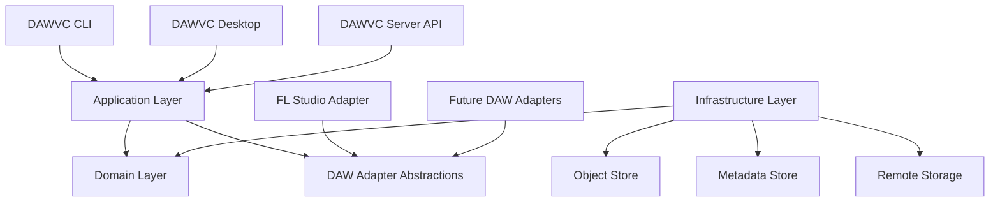
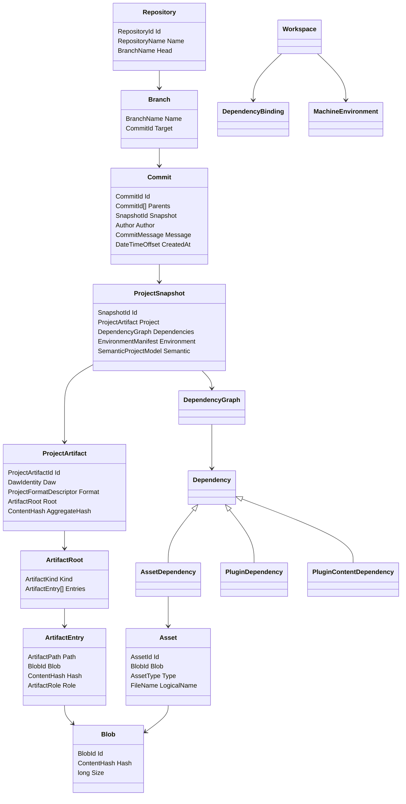
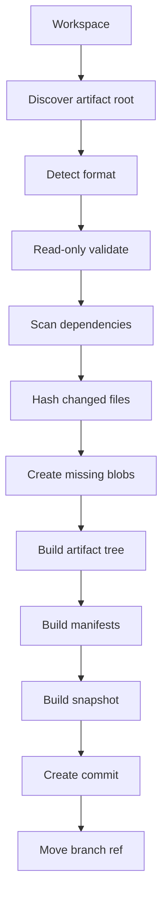
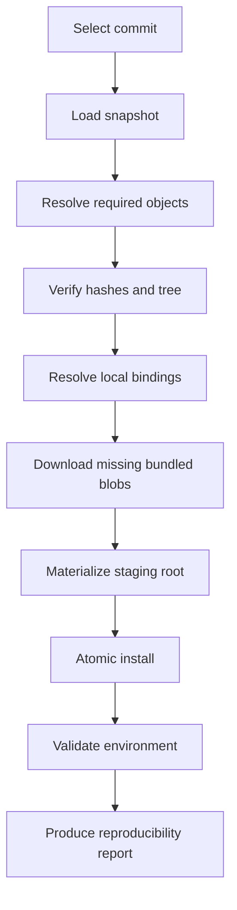
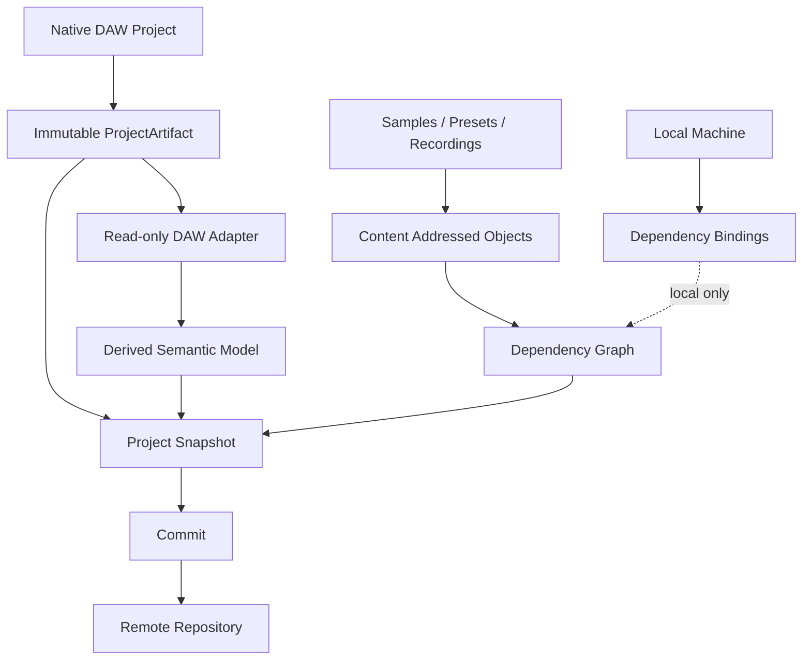

# DAW Version Control — Technical Design

> **Werknaam:** DAWVC  
> **Documentversie:** 1.1  
> **Status:** Technical Design / basis voor implementatie  
> **Primaire implementatie:** C# / .NET 10  
> **Eerste DAW-adapter:** FL Studio  
> **Doelplatformen:** Windows eerst, later macOS/Linux waar relevant

> **Wijziging in v1.1:** generiek artifact-tree-/formatmodel, read-only adapters by default, gescheiden integriteitsniveaus en staged/atomic native artifact handling.

---

# 1. Samenvatting

DAWVC is een version-control- en dependency-managementsysteem voor Digital Audio Workstation-projecten.

Het systeem combineert vier verantwoordelijkheden:

1. **Version control** van projectbestanden en assets.
2. **Dependency management** voor samples, presets, plugins, libraries en andere externe content.
3. **Environment validation** om vast te stellen of een project op een andere machine reproduceerbaar is.
4. **Samenwerking** door branches, commits, remotes, locking en overdraagbare collaboration snapshots.

De kern van DAWVC is bewust **DAW-onafhankelijk**. FL Studio wordt de eerste concrete adapter. Andere DAWs, zoals Ableton Live, Logic Pro, Cubase, REAPER of Bitwig, kunnen later via hetzelfde adapter-contract worden toegevoegd.

Native DAW-projecten worden niet universeel als één bestand gemodelleerd. Een projectartifact kan een los bestand, directory, package of archive zijn. De native bytes blijven altijd de primaire waarheid; inspectie en semantische metadata zijn afgeleide, opnieuw opbouwbare representaties.

De belangrijkste ontwerpregel is:

> **Een dependency wordt geïdentificeerd door zijn inhoud of logische identiteit, nooit door zijn lokale bestandspad.**

Lokale paden, plugin-installatielocaties en sample-librarylocaties zijn machine-specifieke bindings en worden niet als gedeelde projectidentiteit gebruikt.

---

# 2. Probleemdefinitie

DAW-projecten zijn vaak niet zelfstandig overdraagbaar.

Een project kan afhankelijk zijn van:

- het native projectbestand;
- samples;
- recordings;
- stems;
- MIDI;
- presets;
- impulse responses;
- wavetables;
- plugin states;
- third-party plugins;
- pluginversies;
- externe samplelibraries;
- third-party sampler libraries;
- DAW-versies;
- machine-specifieke folderstructuren;
- DAW-specifieke zoekpaden;
- operating-system-specifieke plugininstallaties.

Hierdoor kan hetzelfde project op machine A correct werken, maar op machine B openen met:

- ontbrekende samples;
- ontbrekende plugins;
- verkeerde pluginversies;
- ontbrekende presets;
- ontbrekende externe libraries;
- niet-resolvebare absolute paden;
- gewijzigde audio-assets;
- ontbrekende dependency-context.

Traditionele Git lost dit slechts gedeeltelijk op. Git kan bestanden versioneren, maar begrijpt niet waarom een bepaald bestand nodig is, welke plugin het project verwacht, of een gevonden sample inhoudelijk hetzelfde is als de originele dependency.

DAWVC voegt die semantiek toe.

---

# 3. Productdoelen

## 3.1 Primaire doelen

DAWVC moet:

- DAW-projecten betrouwbaar kunnen versioneren;
- projectassets content-addressed opslaan;
- dubbele assets dedupliceren;
- externe dependencies detecteren;
- dependencies loskoppelen van lokale bestandspaden;
- projectmetadata vastleggen;
- plugins als requirements modelleren zonder plugin-binaries standaard mee te distribueren;
- een project kunnen overdragen naar een andere machine;
- kunnen aangeven waarom een project niet volledig reproduceerbaar is;
- samenwerken met meerdere gebruikers mogelijk maken;
- zowel via CLI als desktopsoftware bruikbaar zijn;
- later meerdere DAWs ondersteunen zonder de core te herschrijven;
- native projectartifacts zonder in-place mutatie opslaan, valideren en herstellen;
- single-file-, directory-, package- en archive-gebaseerde DAW-projecten ondersteunen;
- onbekende of nieuwere projectformaten veilig als opaque artifact kunnen versioneren.

## 3.2 Secundaire doelen

Later moet DAWVC:

- semantische diffs tonen;
- projectonderdelen DAW-onafhankelijk modelleren;
- collaboration snapshots tussen verschillende DAWs ondersteunen;
- partial checkout / lazy asset retrieval ondersteunen;
- grote assets chunked kunnen opslaan en synchroniseren;
- third-party DAW adapters kunnen laden.

---

# 4. Non-goals voor MVP

Versie 0.1 ondersteunt nadrukkelijk nog niet:

- automatische semantische merge van native DAW-projectbestanden;
- realtime collaborative editing;
- volledige conversie tussen FL Studio-, Ableton-, Logic- of andere projectformaten;
- distributie van commerciële plugin-binaries;
- automatische licentieomzeiling;
- cloud-hosting als noodzakelijke voorwaarde;
- perfecte detectie van iedere third-party pluginlibrary;
- content-defined chunking;
- delta-compressie op audiobestandsniveau;
- semantische MIDI/pattern/mixer-diff als harde MVP-eis.

---

# 5. Architectuurprincipes

## 5.1 DAW-agnostische core

De domeinlaag kent geen `FlStudioProject`, `AbletonProject` of `LogicProject`.

De core kent uitsluitend generieke concepten:

- Repository
- Commit
- Snapshot
- ProjectArtifact
- Dependency
- Asset
- Blob
- PluginRequirement
- Workspace
- DependencyBinding
- Environment
- AdapterCapability

DAW-specifieke interpretatie gebeurt via adapters.

## 5.2 Shared state en local state zijn strikt gescheiden

### Shared / versioned

- commits;
- snapshots;
- dependencygraph;
- projectartifacts;
- assets;
- content hashes;
- pluginrequirements;
- metadata;
- semantische projectmetadata;
- portability policies.

### Local / non-versioned

- absolute bestandspaden;
- lokale plugininstallaties;
- lokale samplefolders;
- machineconfiguratie;
- dependencybindings;
- credentials;
- caches.

## 5.3 Paths are locators, never identifiers

```text
Dependency identity != Local path
```

Voorbeeld:

```text
Asset identity:
BLAKE3:a72f...

Machine A:
D:\Samples\Kicks\kick.wav

Machine B:
C:\Audio\Hardcore\kick.wav
```

Beide locaties kunnen naar exact dezelfde dependency verwijzen.

## 5.4 Immutable history

Commits, snapshots en blobs zijn immutable.

Nieuwe wijzigingen produceren nieuwe objecten.

## 5.5 Content-addressed storage

Binary content wordt geïdentificeerd door content hashes.

Voor MVP:

- BLAKE3 voor blob-identiteit;
- SHA-256 optioneel voor interoperabiliteit/integriteitsrapportage.

## 5.6 Capability-based adapters

Niet iedere DAW hoeft dezelfde functionaliteit te ondersteunen.

Een adapter declareert expliciet welke informatie hij kan leveren.

## 5.7 Metadata provenance

Afgeleide metadata moet vastleggen:

- bron;
- confidence;
- detectiemoment;
- eventueel adapterversie.

Het systeem mag inferred metadata niet presenteren alsof die exact uit het native projectbestand afkomstig is.

## 5.8 Native bytes zijn de primaire waarheid

Een `SemanticProjectModel`, dependencygraph of validation report vervangt nooit het oorspronkelijke native projectartifact. Afgeleide data mag met een nieuwere adapter opnieuw worden gegenereerd zonder de gecommitte native bytes te wijzigen.

Een parserfout betekent daarom niet automatisch dat het project corrupt is. DAWVC onderscheidt altijd:

- object-store-integriteit;
- artifact-tree-integriteit;
- native format-validiteit;
- adaptercompatibiliteit.

## 5.9 Read-only adapters en veilige writes

DAW-adapters zijn standaard read-only. Native writing vereist een aparte, expliciete capability en implementatie.

DAWVC schrijft nooit rechtstreeks over een bestaand native projectartifact. Iedere toegestane write gebruikt een tijdelijke candidate, validatie, hashverificatie, duurzame flush en atomic replace. Als het platform geen betrouwbare atomic replace voor het betreffende artifacttype ondersteunt, blijft de write uitgeschakeld.

---

# 6. High-level architectuur



---

# 7. Solutionstructuur

```text
src/

  DawVcs.Domain/
    Repositories/
    Commits/
    Snapshots/
    Dependencies/
    Assets/
    Plugins/
    Workspaces/
    Environments/
    Collaboration/
    Artifacts/
    Validation/

  DawVcs.Application/
    Commands/
    Queries/
    Services/
    UseCases/
    Ports/

  DawVcs.Infrastructure/
    FileSystem/
    Persistence/
    Hashing/
    Compression/
    ObjectStorage/
    Networking/
    Configuration/

  DawVcs.Adapters.Abstractions/
    IDawAdapter.cs
    AdapterCapabilities.cs
    ProjectInspection.cs
    ProjectFormatDescriptor.cs
    ArtifactValidationResult.cs

  DawVcs.Adapters.FLStudio/
    Detection/
    Formats/
    Inspection/
    DependencyScanning/
    Metadata/
    Validation/
    FlpParsing/

  DawVcs.Cli/

  DawVcs.Desktop/

  DawVcs.Server/

tests/

  DawVcs.Domain.Tests/
  DawVcs.Application.Tests/
  DawVcs.Infrastructure.Tests/
  DawVcs.Adapters.FLStudio.Tests/
  DawVcs.IntegrationTests/
  DawVcs.EndToEndTests/
```

---

# 8. Bounded contexts

## 8.1 Version Control

Verantwoordelijk voor:

- repositories;
- refs;
- branches;
- tags;
- commits;
- snapshots;
- history.

## 8.2 Content Store

Verantwoordelijk voor:

- blobs;
- hashing;
- deduplicatie;
- compressie;
- local object storage;
- remote object transfer.

## 8.3 Dependency Management

Verantwoordelijk voor:

- asset dependencies;
- plugin dependencies;
- plugin content;
- dependency graph;
- portability;
- resolution;
- dependency status.

## 8.4 Workspace

Verantwoordelijk voor:

- working tree;
- lokale bindings;
- machine environment;
- file discovery;
- status;
- checkout materialization.

## 8.5 DAW Integration

Verantwoordelijk voor:

- native projectdetectie;
- dependency scanning;
- metadataextractie;
- semantic parsing;
- adapter capabilities.
- projectformat- en containertype-detectie;
- native artifact-validatie;
- safe-write policies voor adapters die expliciet native writing ondersteunen.

## 8.6 Collaboration

Verantwoordelijk voor:

- users;
- projectmembers;
- permissions;
- locks;
- activity;
- remote project coordination.

## 8.7 Cross-DAW Exchange

Pas later.

Verantwoordelijk voor:

- collaboration snapshots;
- stems;
- MIDI;
- tempo maps;
- markers;
- portable common metadata.

---

# 9. Domeinmodel

## 9.1 Overzicht



---

# 10. Aggregates

## 10.1 Repository aggregate

```csharp
public sealed class Repository
{
    public RepositoryId Id { get; }
    public RepositoryName Name { get; }
    public BranchName Head { get; private set; }

    private readonly Dictionary<BranchName, CommitId> _branches;
    private readonly Dictionary<TagName, CommitId> _tags;
}
```

### Invariants

- `HEAD` verwijst naar een geldige branch of detached commit.
- Een branch verwijst altijd naar een bestaande commit.
- Commit-objecten worden na creatie nooit gemuteerd.
- Tags zijn immutable tenzij expliciet force-updated.

---

## 10.2 ProjectSnapshot aggregate

```csharp
public sealed class ProjectSnapshot
{
    public SnapshotId Id { get; }
    public ProjectArtifact Project { get; }
    public DependencyGraph Dependencies { get; }
    public EnvironmentManifest Environment { get; }
    public SemanticProjectModel? Semantic { get; }
}
```

Een snapshot representeert de volledige door DAWVC bekende toestand van het project op één moment.

### Invariants

- iedere gebundelde asset verwijst naar een bestaande blob;
- iedere dependency heeft een stabiele identity;
- lokale absolute paden zijn nooit onderdeel van de identity;
- metadata bevat waar nodig provenance;
- het artifactroot-type past bij de gedetecteerde `ProjectFormatDescriptor`;
- iedere file-entry in de artifact tree verwijst naar een bestaande, hash-gevalideerde blob;
- artifactpaden zijn relatief, genormaliseerd en vrij van path traversal;
- de aggregate hash is deterministisch afgeleid uit containertype, genormaliseerde paden, rollen en entry-hashes;
- de native artifact bytes blijven de primaire waarheid; metadata mag deze bytes niet vervangen;
- snapshot-content verandert nooit na commit.

---

## 10.3 Workspace aggregate

```csharp
public sealed class Workspace
{
    public WorkspaceId Id { get; }
    public RepositoryId Repository { get; }
    public WorkspacePath Root { get; }

    public MachineEnvironment Environment { get; private set; }
    public WorkingTree WorkingTree { get; private set; }

    private readonly Dictionary<DependencyId, DependencyBinding> _bindings;
}
```

### Invariants

- local bindings worden niet gedeeld via commits;
- bindings mogen slechts als `Verified` gelden na inhoudelijke of identity-based verificatie;
- workspace-status is afgeleid van working tree versus HEAD snapshot.

---

## 10.4 DependencyGraph aggregate

```csharp
public sealed class DependencyGraph
{
    public IReadOnlyCollection<DependencyNode> Nodes { get; }
    public IReadOnlyCollection<DependencyEdge> Edges { get; }
}
```

Voorbeeld:

```text
Project
├── Channel "Kick"
│   └── kick.wav
├── Channel "Lead"
│   └── Serum
│       ├── Lead.fxp
│       └── wavetable.wav
└── Channel "Choir"
    └── Kontakt
        └── Choir Library
```

De graph moet niet alleen aangeven **wat** nodig is, maar ook **waarom**.

---

# 11. Entities en value objects

## 11.1 Blob

```csharp
public sealed record Blob(
    BlobId Id,
    ContentHash Hash,
    long Size,
    CompressionType Compression);
```

De blob bevat uitsluitend contentidentiteit en storagegegevens.

Geen bestandspad.

---

## 11.2 ProjectArtifact en artifact tree

```csharp
public sealed record ProjectArtifact(
    ProjectArtifactId Id,
    DawIdentity Daw,
    ProjectFormatDescriptor Format,
    ArtifactRoot Root,
    ContentHash AggregateHash);
```

`ArtifactRoot` ondersteunt verschillende native projectvormen:

```csharp
public abstract record ArtifactRoot(ArtifactKind Kind);

public sealed record SingleFileArtifact(ArtifactEntry File)
    : ArtifactRoot(ArtifactKind.SingleFile);

public sealed record DirectoryArtifact(IReadOnlyCollection<ArtifactEntry> Entries)
    : ArtifactRoot(ArtifactKind.Directory);

public sealed record PackageArtifact(IReadOnlyCollection<ArtifactEntry> Entries)
    : ArtifactRoot(ArtifactKind.Package);

public sealed record ArchiveArtifact(
    ArtifactEntry Archive,
    IReadOnlyCollection<ArchiveIndexEntry>? InspectedEntries)
    : ArtifactRoot(ArtifactKind.Archive);

public sealed record ArchiveIndexEntry(
    ArtifactPath Path,
    ContentHash? Hash,
    long UncompressedSize,
    ArtifactRole Role);
```

Een package is een directory die het operating system als één document kan presenteren. Een archive blijft byte-exact als archiveblob opgeslagen; geïnspecteerde entries zijn een afgeleide index en vervangen de archiveblob niet.

De aggregate hash van een archive is gebaseerd op de archiveblob en het containertype, niet op de vervangbare inspectie-index. Voor directory- en package-artifacts wordt de hash berekend over een canoniek gesorteerde lijst van genormaliseerde paden, rollen, modes en entry-hashes.

Voorbeelden:

| DAW/projectvorm | ArtifactRoot | Opmerking |
|---|---|---|
| FL Studio `.flp` | `SingleFileArtifact` | Native projectfile; externe dependencies staan in de dependencygraph. |
| FL Studio zipped project | `ArchiveArtifact` | Archive blijft intact; inhoud kan read-only worden geïnspecteerd. |
| Ableton Live Project Folder | `DirectoryArtifact` | `.als`, projectinformatie, samples en relevante projectfolderstructuur. |
| Logic Pro package | `PackageArtifact` | Packageboom wordt als één logisch projectartifact geversioneerd. |
| Logic Pro projectfolder | `DirectoryArtifact` | Projectdata en assets als tree. |
| REAPER `.RPP` | `SingleFileArtifact` | Tekstgebaseerd native project, maar nog steeds immutable opgeslagen. |

```csharp
public sealed record ArtifactEntry(
    ArtifactPath Path,
    BlobId Blob,
    ContentHash Hash,
    ArtifactRole Role,
    UnixFileMode? Mode = null);
```

De artifact tree bevat alleen reguliere file-entries; directories worden deterministisch uit hun paden afgeleid. `ArtifactPath` is altijd relatief aan de artifactroot. Absolute paden, `..`-traversal en entries die buiten de materialisatieroot wijzen zijn ongeldig. Symlinks worden in v0.1 niet gevolgd of gematerialiseerd.

```csharp
public enum ArtifactRole
{
    PrimaryProjectFile,
    ProjectMetadata,
    ProjectAsset,
    Cache,
    Generated,
    Unknown
}
```

Adapter- en formatpolicies bepalen welke rollen onderdeel zijn van het geversioneerde artifact. Rebuildable caches en tijdelijke DAW-files worden standaard uitgesloten.

## 11.3 ProjectFormatDescriptor

```csharp
public sealed record ProjectFormatDescriptor(
    FormatId Id,
    DawIdentity Daw,
    ArtifactKind Container,
    FormatVersion? Version,
    IReadOnlyCollection<FileExtension> Extensions,
    ProjectFormatCapabilities Capabilities);
```

Formatdetectie gebruikt niet alleen de extensie. Een adapter combineert waar beschikbaar:

- extensie;
- magic bytes of signature;
- containerstructuur;
- vereiste entries;
- interne versievelden;
- consistente native metadata.

Wanneer detectie niet betrouwbaar genoeg is, retourneert de adapter `UnknownFormat` of `UnsupportedVersion`. Het artifact kan dan nog steeds opaque worden opgeslagen, gecommit, gecheck-out en gehasht; semantische parsing en native writing blijven uitgeschakeld.

## 11.4 Asset

```csharp
public sealed record Asset(
    AssetId Id,
    BlobId Blob,
    AssetType Type,
    FileName LogicalName,
    MediaMetadata? Media);
```

### AssetType

```csharp
public enum AssetType
{
    Sample,
    Recording,
    Stem,
    Preset,
    Midi,
    Score,
    ImpulseResponse,
    Wavetable,
    PluginState,
    Render,
    Artwork,
    Other
}
```

---

## 11.5 Dependency

```csharp
public abstract record Dependency(
    DependencyId Id,
    DependencyKind Kind,
    DependencyRequirement Requirement,
    DependencySource Source,
    PortabilityPolicy Portability);
```

Subtypen:

```text
AssetDependency
PluginDependency
PluginContentDependency
EnvironmentDependency
ExternalDependency
```

---

## 11.6 AssetDependency

```csharp
public sealed record AssetDependency(
    DependencyId Id,
    AssetId Asset,
    ProjectReference Reference,
    DependencyRole Role,
    DependencyRequirement Requirement,
    DependencySource Source,
    PortabilityPolicy Portability)
    : Dependency(...);
```

---

## 11.7 PluginIdentity

```csharp
public sealed record PluginIdentity(
    PluginVendor Vendor,
    PluginProduct Product,
    PluginFormat Format,
    PluginIdentifier? NativeIdentifier);
```

Het lokale pluginbestand is geen identity.

---

## 11.8 PluginDependency

```csharp
public sealed record PluginDependency(
    DependencyId Id,
    PluginIdentity Plugin,
    VersionRequirement? Version,
    PluginRole Role,
    DependencyRequirement Requirement,
    DependencySource Source,
    PortabilityPolicy Portability)
    : Dependency(...);
```

---

## 11.9 PluginContentDependency

Voor content die via plugins wordt geladen:

```csharp
public sealed record PluginContentDependency(
    DependencyId Id,
    PluginIdentity Plugin,
    PluginContentIdentity Content,
    PluginContentType Type,
    DependencyRequirement Requirement,
    DependencySource Source,
    PortabilityPolicy Portability)
    : Dependency(...);
```

Voorbeelden:

- Kontakt library;
- custom Serum wavetable;
- convolution IR;
- sampler library;
- external presetbank.

---

# 12. Dependency identity

DAWVC gebruikt verschillende identitystrategieën.

## 12.1 Asset identity

Primair:

```text
ContentHash
```

Voorbeeld:

```text
BLAKE3:a72f192...
```

## 12.2 Plugin identity

Primair:

```text
Vendor + Product + Format + NativeIdentifier
```

Versie is een requirement, niet noodzakelijk onderdeel van de basisidentity.

## 12.3 Plugin content identity

Kan bestaan uit:

- vendor/library identifier;
- logical library name;
- content hash;
- library metadata;
- adapter-specifieke native identifiers.

## 12.4 Project identity

Een repository representeert het projectconcept.

Een native projectbestand is slechts één artifact binnen die repository.

---

# 13. Resource locators en bindings

## 13.1 ResourceLocator

```csharp
public abstract record ResourceLocator;
```

Subtypen:

```text
FileSystemLocator
RepositoryObjectLocator
LibraryLocator
PluginLocator
ExternalLocator
```

## 13.2 DependencyBinding

```csharp
public sealed record DependencyBinding(
    DependencyId Dependency,
    ResourceLocator Locator,
    BindingMethod Method,
    BindingStatus Status,
    ContentHash? VerifiedHash);
```

### BindingMethod

```csharp
public enum BindingMethod
{
    OriginalPath,
    RelativePath,
    RepositoryAsset,
    LibraryMapping,
    ContentHashDiscovery,
    PluginIdentityMatch,
    UserSelected
}
```

### BindingStatus

```csharp
public enum BindingStatus
{
    Unresolved,
    Candidate,
    Verified,
    Mismatch,
    Missing
}
```

---

# 14. Library mappings

Library mappings zijn lokale configuratie.

```csharp
public sealed record LibraryMapping(
    LibraryId Library,
    FilePath LocalRoot,
    MachineId Machine);
```

Voorbeeld:

### Machine A

```yaml
libraries:
  hardcore:
    path: D:\Samples\Hardcore
```

### Machine B

```yaml
libraries:
  hardcore:
    path: C:\Music\Samples\Hardcore
```

Deze mappings worden niet als projectvereiste geforceerd.

---

# 15. Metadata-model

Metadata wordt verdeeld in drie hoofdgroepen.

## 15.1 Semantic metadata

Beschrijft de muzikale/projectstructuur.

Voorbeelden:

- tempo;
- time signature;
- tracks;
- channels;
- playlist;
- patterns;
- MIDI;
- mixer;
- automation;
- routing;
- markers.

## 15.2 Dependency metadata

Beschrijft vereiste externe resources.

Voorbeelden:

- samples;
- recordings;
- presets;
- wavetables;
- impulse responses;
- plugins;
- libraries.

## 15.3 Reproduction metadata

Beschrijft de omgeving waarin het project correct functioneert.

Voorbeelden:

- DAW;
- DAW-versie;
- OS;
- architectuur;
- pluginformaten;
- pluginversies;
- relevante libraries;
- samplerate;
- overige environment requirements.

---

# 16. Metadata provenance

```csharp
public sealed record MetadataObservation<T>(
    T Value,
    MetadataSource Source,
    ConfidenceLevel Confidence,
    DateTimeOffset ObservedAt,
    string? AdapterVersion);
```

## MetadataSource

```csharp
public enum MetadataSource
{
    NativeProjectParser,
    DawExport,
    ProjectDataFolder,
    FileSystemScan,
    PluginScan,
    PluginState,
    UserInput,
    Inference
}
```

## ConfidenceLevel

```csharp
public enum ConfidenceLevel
{
    Exact,
    Verified,
    Probable,
    Inferred,
    Unknown
}
```

---

# 17. DAW adapter-contract

## 17.1 Interface

```csharp
public interface IDawProjectAdapter
{
    string AdapterId { get; }

    AdapterCapabilities Capabilities { get; }

    ProjectDetectionResult Detect(ArtifactCandidate candidate);

    Task<DawIdentity> IdentifyAsync(
        ArtifactReadContext artifact,
        CancellationToken cancellationToken);

    Task<ProjectInspection> InspectAsync(
        ArtifactReadContext artifact,
        InspectionOptions options,
        CancellationToken cancellationToken);

    Task<DependencyGraph> ScanDependenciesAsync(
        ArtifactReadContext artifact,
        CancellationToken cancellationToken);

    Task<SemanticProjectModel?> ParseSemanticModelAsync(
        ArtifactReadContext artifact,
        CancellationToken cancellationToken);

    Task<ArtifactValidationResult> ValidateAsync(
        ArtifactReadContext artifact,
        ValidationLevel level,
        CancellationToken cancellationToken);
}
```

`ArtifactReadContext` geeft uitsluitend read-only toegang tot de candidate of reeds opgeslagen blobs. De adapter ontvangt geen schrijfbaar pad naar het bronartifact.

Detectie retourneert confidence en bewijs:

```csharp
public sealed record ProjectDetectionResult(
    DetectionStatus Status,
    ProjectFormatDescriptor? Format,
    ConfidenceLevel Confidence,
    IReadOnlyCollection<DetectionEvidence> Evidence);

public enum DetectionStatus
{
    Recognized,
    UnknownFormat,
    UnsupportedVersion,
    Ambiguous
}
```

`ValidationLevel` kent minimaal `Structure`, `Parse` en `Deep`. Structurele validatie mag geen plugins laden of de DAW starten. Deep validation mag alleen expliciet worden aangevraagd en moet in een geïsoleerd proces met timeout draaien.

Native writing staat in een apart contract zodat een read-only adapter niet per ongeluk als writer kan worden gebruikt:

```csharp
public interface IDawProjectWriter
{
    Task<NativeWriteCandidate> CreateCandidateAsync(
        NativeWriteRequest request,
        CancellationToken cancellationToken);

    Task<RoundTripValidationResult> ValidateRoundTripAsync(
        NativeWriteCandidate candidate,
        CancellationToken cancellationToken);
}
```

De application layer accepteert een native write alleen wanneer dezelfde adapter zowel `NativeWrite` als `NativeRoundTripValidation` declareert. Een writer mag nooit de bestaande artifactroot in-place wijzigen.

## 17.2 Capabilities

```csharp
[Flags]
public enum AdapterCapabilities
{
    None = 0,
    ProjectIdentification = 1 << 0,
    NativeRead = 1 << 1,
    NativeValidation = 1 << 2,
    MetadataExtraction = 1 << 3,
    DependencyScanning = 1 << 4,
    PluginScanning = 1 << 5,
    TempoExtraction = 1 << 6,
    TrackExtraction = 1 << 7,
    MidiExtraction = 1 << 8,
    AutomationExtraction = 1 << 9,
    MixerExtraction = 1 << 10,
    SemanticDiff = 1 << 11,
    CollaborationExport = 1 << 12,
    NativeWrite = 1 << 13,
    NativeRoundTripValidation = 1 << 14,
    NativeMerge = 1 << 15
}
```

Een adapter hoeft niet alles te ondersteunen. `NativeWrite`, `NativeRoundTripValidation` en `NativeMerge` staan standaard uit en worden nooit afgeleid uit andere capabilities. `NativeMerge` vereist bovendien de twee write-capabilities.

## 17.3 Validation-resultaat en health-status

```csharp
public sealed record ArtifactValidationResult(
    ArtifactHealth Health,
    ProjectFormatDescriptor? DetectedFormat,
    IReadOnlyCollection<ValidationFinding> Findings,
    AdapterIdentity Adapter,
    DateTimeOffset ValidatedAt);

public enum ArtifactHealth
{
    Valid,
    Suspicious,
    Invalid,
    Unsupported,
    Unknown
}
```

`Unsupported` betekent dat de adapter het artifact of de formatversie niet inhoudelijk kan valideren. `Invalid` betekent dat bekende formatinvariants zijn geschonden. Geen van beide bewijst dat een correct gehashte repositoryblob zelf beschadigd is.

Validatieresultaten zijn afgeleide observations met provenance. Ze mogen opnieuw worden opgebouwd en maken geen deel uit van de identity van de native artifact bytes.

## 17.4 Format policies per adapter

Eén DAW-adapter kan meerdere native projectvormen ondersteunen. Iedere expliciet ondersteunde vorm krijgt een formatpolicy:

```csharp
public interface IProjectFormatPolicy
{
    ProjectFormatDescriptor Descriptor { get; }

    ProjectDetectionResult Detect(ArtifactCandidate candidate);

    Task<ArtifactRootCandidate> DiscoverRootAsync(
        ArtifactCandidate candidate,
        CancellationToken cancellationToken);

    IAsyncEnumerable<ArtifactEntryCandidate> EnumerateVersionedEntriesAsync(
        ArtifactRootCandidate root,
        CancellationToken cancellationToken);

    Task<ArtifactValidationResult> ValidateAsync(
        ArtifactReadContext artifact,
        ValidationLevel level,
        CancellationToken cancellationToken);
}
```

Een formatpolicy legt minimaal vast:

- verwachte containervorm;
- detectieregels en ondersteunde versies;
- primaire projectentry;
- projectkritieke entries;
- gegenereerde/cache-entries die niet worden geversioneerd;
- structurele invariants;
- materialisatie- en collisionregels;
- maximale veilige inspectiedieptes en groottelimieten.

Hierdoor kan bijvoorbeeld de FL Studio-adapter afzonderlijke policies hebben voor `.flp` en zipped projects, terwijl de Ableton-adapter een Live Project Folder-policy en Logic zowel een package- als folderpolicy kan aanbieden.

---

# 18. FL Studio adapter v1

De eerste concrete adapter ondersteunt minimaal:

- `.flp` formatdetectie op basis van extensie én herkenbare structuur/signature;
- projectbestandregistratie;
- read-only structurele validatie;
- externe bestandspaden verzamelen waar technisch betrouwbaar mogelijk;
- samples detecteren;
- recordings detecteren;
- presets detecteren;
- plugin-identiteit detecteren waar mogelijk;
- FL Studio-versie detecteren waar mogelijk;
- metadata-provenance genereren;
- dependencygraph bouwen.

De v1-capabilities zijn:

```text
✓ ProjectIdentification
✓ NativeRead
✓ NativeValidation
✓ DependencyScanning
✓ MetadataExtraction
✗ NativeWrite
✗ NativeRoundTripValidation
✗ NativeMerge
```

Een FLP-versie die nieuwer of onbekend is voor de adapter blijft versioneerbaar als opaque single-file artifact. De adapter mag dan geen semantische interpretatie of wijziging uitvoeren. Ondersteuning voor het FL Studio zipped-projectformaat gebruikt later `ArchiveArtifact` en verandert het core-domeinmodel niet.

De adapter moet zodanig ontworpen worden dat FLP parsing later kan worden uitgebreid zonder dat het domein verandert.

Architectuur:

```text
FLP bytes
   ↓
FLP Reader
   ↓
Raw Events
   ↓
FLP Interpreter
   ↓
Adapter DTOs
   ↓
Canonical DAWVC model
```

Iedere fase consumeert immutable input en produceert een nieuw resultaat. Geen enkele inspectie- of parsefase schrijft terug naar de FLP.

---

# 19. Semantic projectmodel

Dit model is optioneel in MVP.

```csharp
public sealed class SemanticProjectModel
{
    public ProjectSettings Settings { get; }
    public IReadOnlyCollection<SemanticTrack> Tracks { get; }
    public IReadOnlyCollection<SemanticPluginInstance> Plugins { get; }
    public DawSpecificMetadata NativeMetadata { get; }
}
```

Het canonical model is bewust een common denominator.

DAW-specifieke details mogen daarnaast worden opgeslagen.

```text
SemanticProjectModel
├── Common
└── NativeMetadata
```

---

# 20. Environment model

## 20.1 EnvironmentManifest

Versioned requirementinformatie:

```csharp
public sealed class EnvironmentManifest
{
    public DawRequirement Daw { get; }
    public IReadOnlyCollection<PluginDependency> Plugins { get; }
    public IReadOnlyCollection<EnvironmentDependency> Requirements { get; }
}
```

## 20.2 MachineEnvironment

Lokale machine-informatie:

```csharp
public sealed class MachineEnvironment
{
    public MachineId Machine { get; }
    public OperatingSystemInfo OS { get; }
    public Architecture Architecture { get; }

    public IReadOnlyCollection<PluginInstallation> Plugins { get; }
    public IReadOnlyCollection<LibraryMapping> Libraries { get; }
}
```

## 20.3 PluginInstallation

```csharp
public sealed record PluginInstallation(
    PluginIdentity Plugin,
    SemanticVersion Version,
    FilePath InstallationPath,
    ContentHash? BinaryHash);
```

---

# 21. Portability model

Iedere dependency krijgt een portability policy.

```csharp
public enum PortabilityMode
{
    Bundle,
    ReferenceOnly,
    UserChoice,
    Forbidden,
    Unknown
}
```

Voorbeelden:

| Dependency | Default |
|---|---|
| Eigen WAV sample | Bundle |
| Recording | Bundle |
| Eigen preset | Bundle |
| Plugin binary | ReferenceOnly |
| Commerciële samplelibrary | UserChoice / ReferenceOnly |
| Kontakt factory library | ReferenceOnly |
| Onbekende externe content | Unknown |

DAWVC mag nooit automatisch aannemen dat commerciële content legaal herdistribueerbaar is.

---

# 22. Repository layout

Voorgestelde lokale structuur:

```text
MyProject/
│
├── <native projectartifact>
│   ├── project.flp                  # single-file voorbeeld
│   └── of AbletonProject/           # directory-voorbeeld
├── Audio/                           # optionele workspace-assets
├── Samples/
├── Presets/
│
├── dawvc.yaml
│
└── .dawvc/
    ├── HEAD
    ├── config
    ├── index.db
    │
    ├── refs/
    │   ├── heads/
    │   └── tags/
    │
    ├── objects/
    │   ├── 00/
    │   ├── 01/
    │   └── ...
    │
    ├── manifests/
    │   └── artifact-trees/
    ├── locks/
    └── cache/
        └── validation/
```

`dawvc.yaml` wijst de logische artifactroot aan. De repositorylayout veronderstelt niet dat ieder project `project.flp` heet of uit één bestand bestaat.

---

# 23. Object model

Objecttypes:

```text
blob
artifact-tree
asset
dependency-manifest
environment-manifest
semantic-manifest
snapshot
commit
```

Objecten zijn immutable en content-addressed waar praktisch mogelijk.

Conceptueel:

```text
Commit
  ↓
Snapshot
  ├── Project Artifact
  │   └── Artifact Tree
  │       └── Entry Blobs
  ├── Dependency Manifest
  │   └── Assets
  │       └── Blobs
  ├── Environment Manifest
  └── Semantic Manifest
```

---

# 24. Object serialization

Voor MVP:

- JSON voor leesbare metadata/manifests;
- binary content als blob;
- schema-versioning vanaf dag één.

Iedere persistente JSON-structuur bevat:

```json
{
  "schemaVersion": 1
}
```

## 24.1 Canonical artifact-tree serialization

Voor een deterministische aggregate hash gelden minimaal deze regels:

- UTF-8 voor manifesttekst;
- Unicode NFC-normalisatie voor artifactpaden;
- `/` als canonieke separator in manifests;
- geen absolute paden, driveletters, lege componenten, `.` of `..`;
- sortering op de canonieke UTF-8 bytes van het volledige pad;
- duplicate paths na normalisatie zijn ongeldig;
- timestamps en lokale file IDs tellen niet mee in contentidentiteit;
- filemode wordt alleen meegenomen voor de expliciet ondersteunde portable bits;
- case-collisions worden vóór checkout gerapporteerd wanneer het doelfilesystem case-insensitive is.

Dezelfde canonicalizer wordt gebruikt bij commit, remote verification, checkout en `fsck`. Daardoor kan dezelfde tree op verschillende operating systems niet ongemerkt een andere identity krijgen.

Later kan MessagePack/CBOR/Protobuf worden overwogen voor performance, maar nooit ten koste van migratieondersteuning.

---

# 25. Schema versioning

Iedere persisted domain representation krijgt een expliciete schema-versie.

Migraties moeten:

- forward migration ondersteunen;
- nooit stil metadata verliezen;
- oude repositories detecteren;
- migraties dry-run kunnen uitvoeren;
- backups kunnen maken voor destructive migrations.

CLI:

```bash
dawvc migrate
dawvc migrate --dry-run
```

---

# 26. Commit lifecycle



Stappen:

1. bepaal huidige HEAD;
2. ontdek en normaliseer de native artifactroot;
3. detecteer format, containertype en formatversie zonder op alleen de extensie te vertrouwen;
4. scan relevante filesystemwijzigingen;
5. voer read-only structurele validatie uit wanneer de adapter dit ondersteunt;
6. inspecteer dependencies via de DAW-adapter;
7. resolve asset identities;
8. hash nieuwe/gewijzigde artifactentries en dependencies;
9. schrijf ontbrekende blobs;
10. bouw en verifieer de artifact tree en aggregate hash;
11. bouw dependency- en environmentmanifests en cache het validation report als herleidbare observation buiten de snapshotidentity;
12. bouw optioneel semantic manifest;
13. maak snapshot;
14. maak commit;
15. verifieer alle nieuwe objectreferences;
16. update branchref atomisch.

Een incomplete commit mag de repository nooit in een corrupte toestand achterlaten.

Een `Unsupported` of `Unknown` native format mag opaque worden gecommit. Bij `Invalid` of `Suspicious` toont de CLI een duidelijke waarschuwing en vereist de standaardpolicy expliciete bevestiging of `--allow-invalid-artifact`; de bytes worden nooit gerepareerd of herschreven tijdens commit. Het validation report wordt als herleidbare observation buiten de snapshotidentity gecachet.

---

# 27. Checkout lifecycle



Checkout:

1. laad commit;
2. laad snapshot;
3. bepaal benodigde blobs;
4. verifieer objecthashes, artifact tree, genormaliseerde paden en aggregate hash;
5. resolve bestaande lokale dependencies;
6. download ontbrekende gebundelde blobs;
7. materialiseer het volledige artifact in een staginglocatie binnen hetzelfde filesystem;
8. verifieer de gematerialiseerde bytes en voer optioneel native structurele validatie uit;
9. installeer de gevalideerde candidate atomisch zonder een bestaande gewijzigde working tree stil te overschrijven;
10. scan plugins en resolve pluginrequirements;
11. rapporteer format-, dependency- en environmentmismatches afzonderlijk;
12. produceer project health/reproducibility report.

Bij iedere fout vóór de atomic install blijft de bestaande workspace onaangeraakt. Directory- en package-artifacts worden als complete tree geïnstalleerd; een gedeeltelijk gematerialiseerde tree mag nooit als succesvolle checkout zichtbaar worden.

---

# 28. Status lifecycle

`dawvc status` mag niet iedere keer alle assets volledig opnieuw hashen.

Strategie:

1. lees filesystem metadata;
2. vergelijk size/mtime/file-id;
3. gebruik cache;
4. hash alleen verdachte wijzigingen;
5. native projectfile mag agressiever worden gehasht;
6. directory- en package-artifacts vergelijken tevens toegevoegde, verwijderde en hernoemde entries;
7. een snelle metadata-cache mag alleen hashing overslaan als de file identity, size en relevante timestamps consistent zijn;
8. background pre-indexing kan later worden toegevoegd.

---

# 29. Dependency resolution

Resolvervolgorde:

```text
1. Repository materialized asset
2. Existing verified binding
3. Relative path
4. Original path
5. Library mappings
6. Known asset index
7. Content-hash discovery
8. User-assisted selection
9. Unresolved
```

Een gevonden kandidaat is niet automatisch verified.

Voor assets geldt:

```text
candidate path
   ↓
hash
   ↓
expected hash?
   ├── yes → Verified
   └── no  → Mismatch
```

---

# 30. Doctor / reproduction validation

CLI:

```bash
dawvc doctor
```

Voorbeeldoutput:

```text
Project: Apotheosis

Native artifact
✓ FL Studio `.flp` detected
✓ Stored bytes and artifact hash valid
✓ Native structure valid

DAW
✓ FL Studio 2026.x

Assets
✓ 143 / 143 resolved

Plugins
✓ Serum 2.0.19
✓ Vital 1.5
✗ FabFilter Pro-Q 4

Plugin content
⚠ Kontakt Choir Library unresolved

Project reproducibility:
91%

Blocking issues:
- FabFilter Pro-Q 4 missing
- Kontakt Choir Library unresolved
```

Reproducibility is geen absolute garantie, maar een gewogen statusrapport.

`doctor` combineert native artifact health, dependencies en machine environment. `fsck` blijft verantwoordelijk voor repository/object-integriteit. De rapporten mogen naar elkaar verwijzen, maar gebruiken verschillende error codes en mogen elkaars conclusies niet impliciet overschrijven.

Mogelijke statussen:

```text
Reproducible
LikelyReproducible
PartiallyReproducible
Blocked
Unknown
```

---

# 31. Branching

Ondersteund in MVP:

```bash
dawvc branch
dawvc branch experimental
dawvc switch experimental
```

Branches zijn refs naar commits.

Native projectfiles worden initieel als opaque binary behandeld.

---

# 32. Merge-strategie

## MVP

- assets kunnen per bestand worden samengevoegd;
- manifests kunnen structureel worden gemerged;
- dezelfde native DAW-projectfile wordt niet automatisch semantisch gemerged;
- bij conflicterende native-projectwijzigingen moet de gebruiker kiezen of locking gebruiken.

## Later

Adapters kunnen optioneel `SemanticMerge` implementeren.

Dit is capability-based en nooit verplicht voor alle DAWs.

---

# 33. Locking

Voor binaire native projectfiles is pessimistic locking bruikbaar.

```csharp
public sealed record ProjectLock(
    RepositoryId Repository,
    LockTarget Target,
    UserId Owner,
    DateTimeOffset AcquiredAt,
    DateTimeOffset? ExpiresAt);
```

Lock-targets kunnen later fijner worden:

```text
EntireProject
NativeProjectFile
Asset
SemanticScope
```

MVP:

```text
NativeProjectFile
```

CLI:

```bash
dawvc lock project.flp
dawvc unlock project.flp
dawvc locks
```

---

# 34. Remote model

```csharp
public sealed record Remote(
    RemoteName Name,
    Uri Endpoint);
```

Ondersteunde acties:

```text
clone
fetch
pull
push
```

---

# 35. Remote protocol v1

Transport:

- HTTPS;
- REST API;
- JSON metadata;
- binary blob streaming;
- chunked HTTP upload waar mogelijk;
- resumable upload later.

Push-protocol:

1. client stuurt gewenste commits/refs;
2. server bepaalt ontbrekende commit/snapshot/object IDs;
3. client uploadt alleen ontbrekende objecten;
4. server valideert hashes;
5. server schrijft objecten;
6. server update ref atomisch indien fast-forward of toegestane force-update.

Conceptueel:

```text
Client                   Server
  |                         |
  | object inventory -----> |
  | <--- missing object IDs |
  |                         |
  | upload missing blobs -->|
  | upload manifests ------>|
  | upload commits -------->|
  | update ref -----------> |
```

---

# 36. Remote storage

MVP-server:

- PostgreSQL voor metadata/users/permissions;
- S3-compatible object storage voor blobs;
- MinIO geschikt voor self-hosted development;
- local filesystem backend voor development/tests.

De domainlaag kent geen S3-concepten.

---

# 37. Authentication en authorization

Remote functionaliteit gebruikt:

- OIDC/OAuth2 waar mogelijk;
- bearer tokens voor CLI;
- refresh token storage in OS credential store;
- repositoryrollen.

Mogelijke rollen:

```text
Owner
Maintainer
Contributor
ReadOnly
```

Permissions:

```text
ReadRepository
Push
CreateBranch
DeleteBranch
ManageLocks
ManageMembers
ManageRepository
```

---

# 38. CLI design

Basis:

```text
dawvc init
dawvc scan
dawvc status
dawvc add
dawvc commit
dawvc log

dawvc branch
dawvc switch
dawvc tag

dawvc doctor

dawvc remote
dawvc fetch
dawvc pull
dawvc push
dawvc clone

dawvc lock
dawvc unlock
dawvc locks
```

Later:

```text
dawvc diff
dawvc diff --semantic
dawvc inspect
dawvc export-collab
dawvc import-collab
dawvc migrate
dawvc gc
dawvc fsck
```

---

# 39. Desktoparchitectuur

Aanbevolen:

- Avalonia;
- MVVM;
- zelfde Application Layer als CLI;
- geen businesslogica in ViewModels.

```text
Desktop UI
   ↓
ViewModels
   ↓
Application Commands/Queries
   ↓
Domain
```

Hoofdschermen:

```text
Project
Changes
History
Branches
Dependencies
Plugins
Environment
Collaboration
Remote
Settings
```

---

# 40. Technologiekeuze

## Core

- C#;
- .NET 10 LTS.

## CLI

- `System.CommandLine`;
- `Spectre.Console`.

## Desktop

- Avalonia;
- MVVM Toolkit of ReactiveUI indien gewenst.

## Local persistence

- SQLite;
- Dapper of EF Core.

Voorkeur voor lokale metadata: **SQLite + Dapper** vanwege voorspelbaarheid en lage overhead.

## Server

- ASP.NET Core;
- PostgreSQL;
- S3-compatible storage.

## Hashing

- BLAKE3.

## Compressie

- Zstandard voor metadata/geschikte blobs;
- reeds gecomprimeerde audioformaten niet blind opnieuw comprimeren.

## Logging

- Serilog.

## Tests

- xUnit;
- FluentAssertions;
- NSubstitute waar mocking nodig is.

## CI/CD

- GitHub Actions;
- build;
- tests;
- formatting;
- package artifacts;
- end-to-end smoke tests.

---

# 41. Local persistence

SQLite bevat geen primaire blobdata.

SQLite bevat:

- workspace index;
- local bindings;
- filesystem cache;
- objectindex;
- adapterinspection cache;
- machine environment cache.

Blobs blijven in object storage.

---

# 42. Performanceprincipes

## MVP

- file hash cache;
- filesystem metadata cache;
- parallel hashing;
- streaming I/O;
- bounded concurrency;
- geen volledig bestand in memory laden;
- lazy dependency resolution;
- duplicate detection via hash index.

## Later

- FastCDC/content-defined chunking;
- partial clone;
- lazy checkout;
- remote blob caching;
- pack files;
- delta metadata;
- distributed cache.

---

# 43. Grote audiobestanden

Audio wordt in MVP op file-level geversioneerd.

Voorbeeld:

```text
Recording.wav
→ één Blob
```

Later:

```text
Recording.wav
├── chunk A
├── chunk B
├── chunk C
└── chunk D
```

Chunking is nadrukkelijk **geen MVP-eis**.

---

# 44. Garbage collection

Omdat objecten immutable zijn kan orphaned data ontstaan.

Later:

```bash
dawvc gc
```

GC verwijdert alleen objecten die:

- vanuit geen enkele ref bereikbaar zijn;
- buiten een retention window vallen;
- niet door locks/pending transactions worden beschermd.

Dry-run:

```bash
dawvc gc --dry-run
```

---

# 45. Repository integrity

CLI:

```bash
dawvc fsck
dawvc fsck --repository
dawvc fsck --artifacts
dawvc fsck --deep
```

`fsck` rapporteert twee onafhankelijke integriteitslagen.

## 45.1 Repository integrity

Controleert:

- objecthashes;
- commit parent references;
- snapshot references;
- manifest references;
- ontbrekende blobs;
- ongeldige refs;
- schemaversies;
- artifact-tree references;
- aggregate hashes;
- genormaliseerde artifactpaden en path traversal;
- artifactroot/container-invariants.

## 45.2 DAW artifact integrity

Wanneer de adapter `NativeValidation` ondersteunt, controleert dit niveau:

- formatdetectie en detection confidence;
- containerstructuur en vereiste entries;
- ondersteunde of onbekende formatversie;
- structurele parsebaarheid;
- interne references voor zover de adapter die betrouwbaar kan beoordelen;
- optioneel deep validation in een geïsoleerd proces.

Het rapport houdt de uitkomsten strikt gescheiden:

```text
Repository
✓ Alle objecthashes geldig
✓ Artifact tree compleet
✓ Snapshotreferenties geldig

Native artifact
✗ Adapter kon FLP-structuur niet parsen
✓ Raw artifactbytes zijn byte-exact aanwezig

Resultaat
Repository healthy; native artifact validity unknown or invalid
```

`AdapterParseFailed`, `UnsupportedVersion` en `NativeArtifactInvalid` zijn verschillende fouten. Een adapter die een bestand niet begrijpt mag nooit automatisch `BlobCorrupt` rapporteren.

---

# 46. Atomiciteit

Operaties die refs wijzigen moeten transactioneel zijn.

Bijvoorbeeld commit:

```text
write blobs
write manifests
write snapshot
write commit
verify
atomic ref update
```

Als de applicatie crasht vóór ref-update blijven hooguit unreachable objects achter.

De repository mag niet half naar een niet-bestaande commit verwijzen.

## 46.1 Safe materialization en native writes

Checkout en eventuele toekomstige native writes gebruiken hetzelfde candidate-protocol:

```text
existing artifact
      │
      └────────────── blijft onaangeraakt

temporary candidate op hetzelfde filesystem
      ↓
write complete file/tree
      ↓
fsync files en relevante directorymetadata
      ↓
verify entry hashes + aggregate hash
      ↓
adapter validation
      ↓
optionele round-trip validation
      ↓
atomic replace / atomic directory swap
```

Invariants:

- nooit in-place bytes wijzigen;
- nooit een gedeeltelijke tree publiceren;
- de tijdelijke candidate gebruikt een onvoorspelbare naam binnen een gecontroleerde stagingdirectory;
- path traversal en onverwachte symlinks worden vóór materialisatie geweigerd;
- de bestaande working tree wordt niet overschreven wanneer die sinds de operatie is gewijzigd;
- bij een fout wordt de candidate verwijderd of als recovery artifact gemarkeerd;
- een platform zonder betrouwbare atomic install voor het artifacttype gebruikt copy-on-write plus expliciete backup/rollback, of schakelt de write uit;
- de branchref wordt pas bijgewerkt nadat alle repositoryobjecten duurzaam en verifieerbaar zijn opgeslagen.

Native writes door adapters blijven post-MVP en zijn alleen toegestaan met zowel `NativeWrite` als `NativeRoundTripValidation`. Checkout van reeds opgeslagen bytes is materialisatie, geen native format-writing.

Wanneer de DAW zelf een nieuwe corrupte versie opslaat, blijven alle eerdere committed artifacts bereikbaar. Recovery materialiseert standaard naar een aparte restore-locatie of vereist een expliciete overwrite-keuze, zodat ook het verdachte huidige bestand behouden blijft voor diagnose.

---

# 47. Cross-DAW collaboration

Native projectconversie is geen core-doel.

DAWVC converteert of overschrijft nooit het bronartifact wanneer twee producers verschillende DAWs gebruiken. Iedere DAW houdt een eigen native `ProjectArtifact`; de gedeelde `CollaborationSnapshot` is een afzonderlijk, DAW-neutraal exchange-object.

In plaats daarvan komt later een `CollaborationSnapshot`.

```csharp
public sealed class CollaborationSnapshot
{
    public TempoMap Tempo { get; }
    public IReadOnlyCollection<CollaborationTrack> Tracks { get; }
    public IReadOnlyCollection<Marker> Markers { get; }
    public IReadOnlyCollection<PluginRequirement> Plugins { get; }
}
```

Een track kan bevatten:

- rendered stem;
- MIDI;
- automation export;
- naam;
- start-offset;
- routingnotities.

Flow:

```text
FL Studio project
    ↓
FL Studio adapter (read-only export)
    ↓
CollaborationSnapshot
    ↓
Ableton adapter/importer
    ↓
nieuwe Ableton artifact candidate
    ↓
validatie + atomic install
```

Dit is geen perfecte native conversie, maar een betrouwbare uitwisselingslaag.

De minimale `import-collab` materialiseert stems, MIDI, tempo, markers en notes in een nieuwe exchange-workspace. Het genereren van een native `.als`, `.logicx`, `.flp` of ander DAW-format is alleen toegestaan wanneer de doeladapter expliciet `NativeWrite` én `NativeRoundTripValidation` ondersteunt. Zonder die capabilities opent de producer de exchange-workspace in de doel-DAW en laat die DAW zelf een nieuw native project opslaan.

Conceptueel kunnen beide artifacts naast elkaar bestaan:

```text
Repository
├── FL Studio ProjectArtifact
├── Ableton ProjectArtifact
└── CollaborationSnapshot
    ├── Audio stems
    ├── MIDI
    ├── Tempo map
    ├── Markers
    └── Notes / plugin manifest
```

Niet-mapeerbare DAW-specifieke eigenschappen blijven in het oorspronkelijke native artifact en optionele `NativeMetadata` bewaard. Het canonical model is een common denominator voor inspectie en exchange, niet een lossless vervanging van ieder DAW-format.

---

# 48. Security

DAWVC verwerkt lokale bestanden en potentieel commerciële content.

Principes:

- geen stille uploads;
- duidelijke remote scopes;
- secrets nooit in repository;
- credentials in OS credential store;
- objecthashvalidatie;
- path traversal voorkomen tijdens checkout;
- symlink handling expliciet;
- server-side size limits;
- uploadhash controleren;
- geen executables automatisch uitvoeren;
- plugin binaries nooit automatisch installeren;
- native projectparsers behandelen input als onbetrouwbare data;
- parserprocessen krijgen waar mogelijk resource limits, timeouts en minimale filesystemrechten;
- structurele validatie laadt geen third-party plugins en start de DAW niet;
- deep validation of DAW-openbaarheidstests zijn opt-in en draaien geïsoleerd;
- archive extraction past limieten toe op entry-aantal, nesting en totale uitgepakte grootte om zip bombs te voorkomen.

---

# 49. Licensing en redistribution

Dependencies krijgen portabilitymetadata.

DAWVC maakt onderscheid tussen:

```text
Project requires X
```

en:

```text
Project bundles X
```

Plugins zijn standaard:

```text
ReferenceOnly
```

Commercial libraries zijn:

```text
ReferenceOnly
```

of:

```text
UserChoice
```

tenzij de gebruiker expliciet bevestigt dat bundling toegestaan is.

DAWVC is geen licentie- of DRM-omzeilingssysteem.

---

# 50. Privacy

Projectmetadata kan bestandsnamen en oorspronkelijke paden bevatten.

Daarom:

- absolute origin paths standaard niet naar remote sturen tenzij nodig/geconfigureerd;
- local bindings nooit synchroniseren;
- gebruikers kunnen path-redaction configureren;
- remote manifests bevatten bij voorkeur logical names in plaats van persoonlijke user-directory paths.

---

# 51. Observability

Loggingcategorieën:

```text
Repository
Workspace
Hashing
DependencyScan
Adapter
ArtifactValidation
NativeWrite
Remote
Checkout
Commit
Locking
Migration
```

Logging moet:

- structured zijn;
- geen secrets bevatten;
- bij debug mode provenance en resolution decisions kunnen tonen.

---

# 52. Error model

Application errors worden typed.

Voorbeelden:

```text
RepositoryNotFound
RepositoryCorrupt
ObjectMissing
ObjectHashMismatch
DependencyUnresolved
PluginMissing
PluginVersionMismatch
AdapterUnavailable
AdapterUnsupportedFormat
AdapterParseFailed
UnknownProjectFormat
UnsupportedFormatVersion
NativeArtifactSuspicious
NativeArtifactInvalid
ArtifactTreeInvalid
ArtifactPathCollision
AtomicInstallUnavailable
RoundTripValidationFailed
LockConflict
RemoteRejected
SchemaMigrationRequired
```

CLI vertaalt deze naar consistente exit codes.

---

# 53. Testing strategy

## 53.1 Unit tests

Domein:

- commit invariants;
- dependency identity;
- portability policies;
- binding status;
- graph validation;
- artifact-path normalisatie;
- deterministic aggregate hashing;
- artifactroot/container-invariants;
- capability gating voor native writes;
- onderscheid tussen repository corruption en adapter/format failure.

## 53.2 Adapter fixture tests

Per DAW-versie worden kleine fixtureprojecten opgeslagen.

FL Studio-fixtures:

```text
empty-project
single-sample
external-sample
missing-sample
single-plugin
plugin-preset
recording
multiple-assets
renamed-sample
moved-sample
truncated-flp
wrong-extension
valid-extension-invalid-signature
unknown-newer-version
opaque-unsupported-format
```

Vanaf de tweede adapter komt een gedeelde formatmatrix met minimaal:

```text
single-file
directory
package
archive
missing-required-entry
unexpected-symlink
path-traversal-entry
empty-artifact
large-artifact-tree
```

## 53.3 Golden tests

Adapteroutput wordt vergeleken met bekende manifests.

```text
input.flp
→ expected-inspection.json
```

## 53.4 Integration tests

- commit → checkout;
- clone → doctor;
- push → clone;
- moved dependency → hash rediscovery;
- plugin path changes;
- branch switch;
- lock conflict;
- checkout naar staging → hashverificatie → atomic install;
- crash vóór en na ref-update;
- crash tijdens file- en directorymaterialisatie;
- parser exception zonder mutatie van bronbytes;
- unknown format commit → checkout met identieke bytes;
- mislukte native validation terwijl repository `fsck` gezond blijft.

## 53.5 End-to-end test

Machine A:

```text
init
scan
commit
push
```

Machine B:

```text
clone
checkout
doctor
```

Verwachte uitkomst:

- alle bundled assets aanwezig;
- lokale paths mogen verschillen;
- pluginrequirements correct gerapporteerd;
- projectfile opent zonder ontbrekende bundled assets;
- projectartifact is byte-exact of tree-exact gelijk aan de gecommitte versie;
- een afgebroken checkout laat de vooraf bestaande workspace onaangeraakt.

## 53.6 Native-write en round-trip tests

Zolang een adapter geen `NativeWrite` declareert, moeten contracttests bewijzen dat geen schrijfroute beschikbaar is. Zodra writing later wordt toegevoegd, zijn minimaal vereist:

- golden round-trip fixtures per expliciet ondersteunde formatversie;
- byte- en semantische vergelijking van niet-gewijzigde data;
- behoud van onbekende/native-only data;
- DAW-openbaarheidstest waar automatisering en licentie dit toelaten;
- fault injection bij iedere writefase;
- rollbacktest bij validation failure;
- expliciete weigering van onbekende nieuwere formatversies.

---

# 54. FL Studio adapter validatie

Tijdens development moeten gevonden dependencies worden gecontroleerd tegen:

- handmatig bekende fixture-inhoud;
- door FL Studio geëxporteerde projectdata waar bruikbaar;
- gecontroleerde testprojecten;
- verschillende FL Studio-versies.

De adapter mag een dependency als `Unknown/Probable` registreren wanneer interpretatie onzeker is.

Dezelfde terughoudendheid geldt voor formatvalidatie:

- `Valid` alleen wanneer alle door die adapterversie bekende harde invariants slagen;
- `Unsupported` voor een herkend maar niet ondersteund format of versie;
- `Unknown` bij onvoldoende detection confidence;
- `Invalid` alleen bij een concrete geschonden formatinvariant;
- nooit native bytes aanpassen als onderdeel van detectie, inspectie of validatie.

---

# 55. MVP v0.1

## Scope

CLI-only mag als eerste milestone.

Commando's:

```text
dawvc init
dawvc scan
dawvc status
dawvc add
dawvc commit
dawvc log
dawvc checkout
dawvc branch
dawvc switch
dawvc doctor
```

Functionaliteit:

- één lokale repository;
- FL Studio adapter;
- `.flp` als `SingleFileArtifact` bovenop het generieke artifact-tree-model;
- formatdetectie, read-only validatie en opaque fallback;
- `NativeWrite` expliciet uitgeschakeld;
- asset discovery;
- BLAKE3 object store;
- deduplicatie;
- snapshots;
- commits;
- branches;
- checkout;
- lokale dependencybindings;
- pluginmanifest;
- doctor report.

Geen remote vereist voor v0.1.

---

# 56. MVP v0.1 acceptance criteria

v0.1 is af wanneer het volgende scenario betrouwbaar werkt.

## Scenario

### Machine A

1. gebruiker opent bestaand FL Studio-project;
2. `dawvc init`;
3. `dawvc scan`;
4. DAWVC detecteert project + relevante assets;
5. `dawvc commit -m "Initial version"`;
6. repository wordt naar een andere locatie gekopieerd.

### Machine B

1. repository wordt geopend;
2. lokale folderstructuur is anders;
3. `dawvc checkout`;
4. bundled assets worden gematerialiseerd;
5. bestaande identieke samples worden via hash herkend;
6. plugin requirements worden gecontroleerd;
7. `dawvc doctor` rapporteert ontbrekende plugins/libraries;
8. dezelfde assets worden niet dubbel opgeslagen.

## Harde criteria

- absolute paths zijn geen dependency identity;
- dezelfde asset met ander pad wordt herkend;
- gewijzigde content met dezelfde filename wordt als andere asset gezien;
- commits zijn immutable;
- checkout is reproduceerbaar voor bundled content;
- corrupte blobs worden gedetecteerd;
- lokale bindings lekken niet naar gedeelde projectmetadata;
- een `.flp` checkout heeft exact dezelfde bytes als de gecommitte blob;
- een onbekende nieuwere FLP kan opaque worden gecommit en hersteld zonder parsepoging die bytes wijzigt;
- een truncated/ongeldige FLP wordt onderscheiden van een corrupte repositoryblob;
- een afgebroken checkout overschrijft geen bestaand projectbestand;
- formatdetectie vertrouwt niet uitsluitend op de bestandsextensie;
- de core kan een directory-, package- en archive-artifact representeren, ook al ondersteunt v0.1 functioneel alleen FL Studio single-file-projecten;
- de FL Studio-adapter biedt geen native schrijfpad.

---

# 57. MVP v0.2

Toevoegen:

- remote server;
- clone;
- fetch;
- push;
- pull;
- authentication;
- project locks;
- meerdere gebruikers;
- object negotiation.

---

# 58. MVP v0.3

Toevoegen:

- Avalonia desktopapp;
- visual history;
- dependency dashboard;
- project health;
- plugin status;
- branch UI;
- lock UI.

---

# 59. Post-MVP

## Fase 4

- uitgebreidere FLP parser;
- semantic metadata;
- semantic diff.

## Fase 5

- tweede DAW adapter;
- aanbevolen kandidaat: Ableton Live of REAPER;
- abstraction validation.

## Fase 6

- collaboration snapshots;
- cross-DAW stems/MIDI/tempo.

## Fase 7

- chunked object storage;
- partial clone;
- lazy checkout;
- packfiles.

---

# 60. Belangrijke architectuurrisico's

## 60.1 Native projectformaten zijn niet publiek/stabiel

Mitigatie:

- adapters isoleren;
- provenance;
- capability flags;
- fixturetests;
- signature/structure/version-detectie in plaats van extensie-only detectie;
- onbekende versies opaque opslaan;
- read-only parsing als standaard;
- native writing alleen met expliciete round-trip capability;
- graceful degradation zonder de bronbytes te muteren.

## 60.2 Projecten hebben verschillende containervormen

Een native project kan een file, directory, package of archive zijn. Een single-blob-domeinmodel zou foldercontext verliezen of packages onveilig platmaken.

Mitigatie:

- `ArtifactRoot` met expliciete containervormen;
- genormaliseerde artifact tree;
- entry- en aggregate hashes;
- adapter-specifieke structurele invariants;
- complete-tree staging en atomic install;
- caches en gegenereerde entries via formatpolicy uitsluiten.

## 60.3 Third-party plugins verbergen dependencies

Mitigatie:

- plugin-specific resolvers later;
- plugin content als apart dependencytype;
- `Unknown` dependency state ondersteunen;
- user-assisted binding.

## 60.4 Grote audiofiles

Mitigatie:

- streaming I/O;
- BLAKE3;
- deduplicatie;
- later chunking.

## 60.5 Licenties

Mitigatie:

- portability policy;
- reference-only default voor plugins/commerciële libraries.

## 60.6 Merge van binaire projectfiles

Mitigatie:

- locking;
- branches;
- geen magische auto-merge;
- semantic merge alleen per adapter capability.

---

# 61. ADRs — Architecture Decision Records

Aanbevolen direct vast te leggen:

```text
ADR-001  Core is DAW-agnostic
ADR-002  Paths are locators, not identifiers
ADR-003  Content-addressed asset storage
ADR-004  BLAKE3 as primary content hash
ADR-005  Native DAW projectfiles are opaque in MVP
ADR-006  Adapter capability model
ADR-007  Shared state separated from local bindings
ADR-008  Plugin binaries are reference-only by default
ADR-009  SQLite for local metadata
ADR-010  JSON manifests with schema versioning
ADR-011  Locking before semantic merge
ADR-012  Cross-DAW exchange uses collaboration snapshots
ADR-013  Native projects use a file/directory/package/archive artifact model
ADR-014  Native bytes are the primary source of truth
ADR-015  DAW adapters are read-only by default
ADR-016  Native files are never modified in-place
ADR-017  Repository integrity and native artifact validity are separate health domains
ADR-018  Unknown format versions remain opaque but versionable
```

---

# 62. Open technical decisions

Deze punten hoeven implementatie niet te blokkeren, maar moeten vóór relevante fases worden besloten:

1. Dapper versus EF Core voor server-side metadata.
2. Exact formaat van object headers.
3. Compressiepolicy per assettype.
4. Hoe plugin native identifiers per format worden genormaliseerd.
5. Hoe DAW-specific metadata wordt geserialiseerd.
6. Welke metadata uit origin paths remote mag worden opgeslagen.
7. Exact remote object-negotiation protocol.
8. Tweede DAW na FL Studio.
9. Criteria voor semantic compatibility tussen pluginversies.
10. Reproducibility score-algoritme.
11. Platformstrategie voor atomic directory/package replacement.
12. Exacte minimumcriteria voordat een adapter `NativeWrite` mag declareren.
13. Welke directory/package entries per DAW generated cache of project-critical zijn.
14. Retentie- en remote-cachepolicy voor reproduceerbare validation observations.

---

# 63. Aanbevolen implementatievolgorde

```text
1. Solution skeleton
2. Domain IDs/value objects
3. Blob + content hash
4. ArtifactRoot + ArtifactEntry + aggregate hash
5. Local object store
6. Repository + refs
7. Commit + snapshot
8. Workspace
9. DependencyGraph
10. AssetDependency
11. CLI init/status/commit/log
12. Adapter abstractions + format detection/validation
13. FL Studio read-only adapter v1
14. DependencyBinding
15. Doctor
16. Staged/atomic checkout
17. Branch/switch
18. Integrity/fsck met gescheiden health domains
19. Remote protocol
20. Server
21. Desktop
22. Semantic FLP parsing
23. Tweede DAW adapter om de artifactabstractie te bewijzen
24. Native writing alleen als afzonderlijke post-MVP capability
```

---

# 64. Definition of Done voor de core

De core is architecturaal geslaagd wanneer:

- geen Domain-project naar FL Studio/Ableton specifieke code verwijst;
- repository history zonder GUI/CLI kan functioneren;
- local paths uit shared identities zijn verwijderd;
- een dependency op meerdere machines andere bindings kan hebben;
- contenthashes deduplicatie correct uitvoeren;
- een adapter vervangen kan worden zonder repositorylogica aan te passen;
- een tweede DAW-adapter kan worden toegevoegd zonder core-domainwijzigingen;
- persisted schemas versieerbaar zijn;
- repositories recoverable en verifieerbaar zijn;
- single-file-, directory-, package- en archive-projecten zonder corewijziging representeerbaar zijn;
- raw native bytes altijd onafhankelijk van afgeleide metadata herstelbaar zijn;
- een adapterparsefout niet als repositorycorruptie wordt geclassificeerd;
- checkout nooit een gedeeltelijk artifact publiceert;
- adapters zonder `NativeWrite` technisch geen native wijzigingsroute hebben;
- onbekende formatversies veilig opaque kunnen worden geversioneerd.

---

# 65. Kernconcept in één diagram



---

# 66. Fundamentele ontwerpregels

1. **DAWVC past zich aan de producer aan; de producer hoeft zijn folderstructuur niet aan DAWVC aan te passen.**
2. **Filesystem paths zijn locators, nooit identifiers.**
3. **Contentidentiteit is leidend voor assets.**
4. **Pluginidentiteit staat los van plugin-installatiepad.**
5. **Shared projectstate en local machine state blijven gescheiden.**
6. **Dependencies zijn first-class domain objects.**
7. **Metadata bevat provenance wanneer interpretatie niet absoluut is.**
8. **Native DAW-projectfiles worden in MVP niet automatisch gemerged.**
9. **Adapters beschrijven capabilities in plaats van een universele feature-set te forceren.**
10. **Cross-DAW samenwerking is een exchange-probleem, geen native projectconversieprobleem.**
11. **Licentiegevoelige dependencies worden standaard niet gebundeld.**
12. **Een checkout is pas succesvol wanneer bundled content aanwezig is én unresolved requirements transparant worden gerapporteerd.**
13. **Een native project is een artifactroot en kan een bestand, directory, package of archive zijn.**
14. **De oorspronkelijke native bytes zijn de primaire waarheid; parsed metadata is afgeleid en vervangbaar.**
15. **DAW-adapters zijn read-only tenzij native writing én round-trip-validatie expliciet ondersteund worden.**
16. **Native artifacts worden nooit in-place gewijzigd of gedeeltelijk gepubliceerd.**
17. **Repository-integriteit, native format-validiteit en adaptercompatibiliteit worden afzonderlijk gerapporteerd.**
18. **Onbekende of nieuwere formats blijven opaque maar volledig versioneerbaar.**

---

# 67. Eindarchitectuur

De uiteindelijke productvorm is:

```text
                    DAWVC

       Version Control
             +
       Dependency Management
             +
       Environment Validation
             +
       Collaboration
             +
       DAW Adapter Platform
             =
       Reproduceerbare muziekprojecten
```

De eerste versie concentreert zich op FL Studio, maar geen enkel fundamenteel onderdeel van de core mag afhankelijk zijn van FL Studio-specifieke semantiek.

Het succescriterium is niet alleen:

> "Kunnen we een `.flp` committen?"

maar:

> **"Kunnen twee producers hetzelfde muzikale project op verschillende machines en DAWs betrouwbaar reconstrueren, versioneren en verder ontwikkelen zonder dat lokale folderstructuren, ontbrekende assets, impliciete dependencies of onveilige formatconversie het native project beschadigen?"**

Dat is de centrale architectuurvraag waarop DAWVC is ontworpen.
